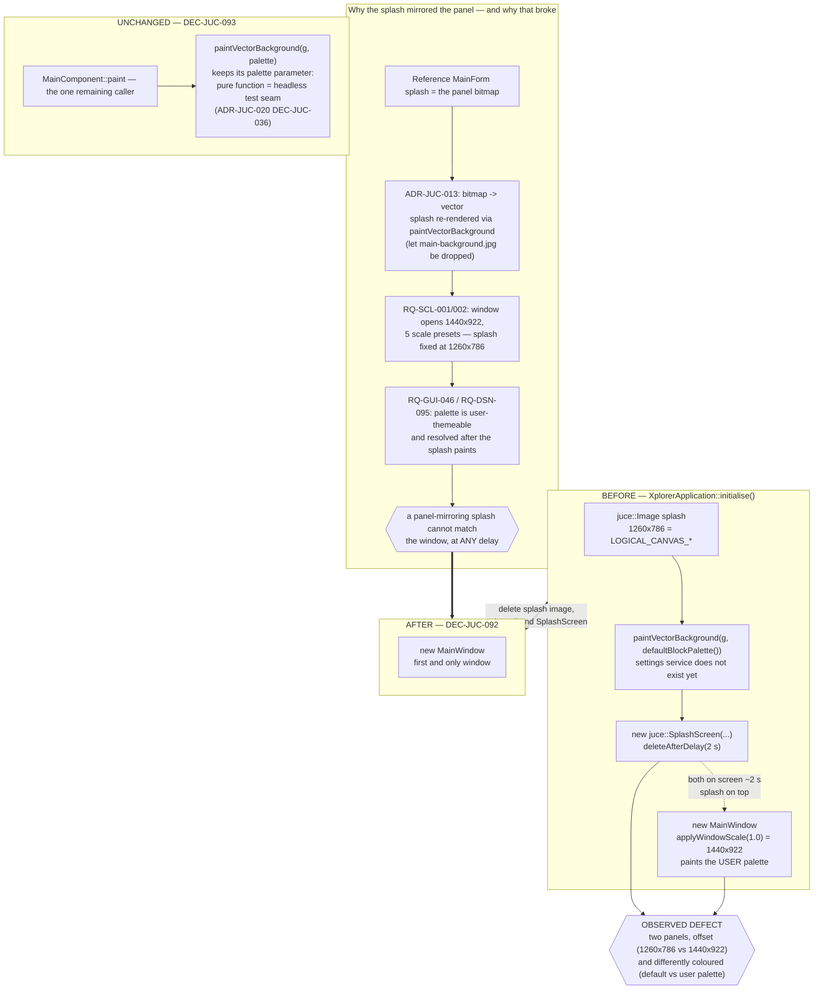

# ADR-JUC-030: Removal of the Splash Screen

## Status
Accepted — implemented and merged to `feature/GFX`: DEC-JUC-092/093
(TASK-GFX-004, PLAN-GFX-002). Full build clean, app launches cleanly, all 6 test
suites green (2982 assertions), 0 test modified.

<!-- Motivated by RQ-GUI-055 (no splash screen), which supersedes the
splash-screen item of RQ-GUI-025. Reverses the splash half of ADR-JUC-013
(the "render the vector background into an offscreen image for the splash"
paragraph) and removes the second call site named in ADR-JUC-020's
Consequences. Touches nothing in ADR-JUC-025 (window size/scale). -->

## Requirements
RQ-GUI-055, RQ-GUI-025 *(splash item struck)*, RQ-GUI-005, RQ-GUI-037,
RQ-GUI-046, RQ-SCL-001, RQ-SCL-002, RQ-DSN-095, RQ-FMW-072, RQ-GUI-035

## Context

Owner report, 2026-08-04 (Windows): for about one second at launch, two panels
are visible at once — superimposed, offset, and in different colours.

Verified in `Main.cpp` before deciding. It is not a rendering artefact; both
surfaces are genuinely painted, and every visible property follows from the code:

| Observed | Cause |
|---|---|
| Two panels at once, ~1 s | `initialise()` constructs the `SplashScreen` with `deleteAfterDelay(2 s)` **and** `MainWindow` immediately after. Both are live for the whole delay, splash on top |
| Different sizes | Splash image is `LOGICAL_CANVAS_WIDTH × LOGICAL_CANVAS_HEIGHT` = 1260×786; the window is `windowSizeForScale(1.0)` = 1440×922 (RQ-SCL-001, ADR-JUC-025) |
| Different colours | Splash paints `defaultBlockPalette()`; the window behind paints the user's palette. The comment in place says why: the splash renders before the settings service exists (ADR-JUC-020, DEC-JUC-036) |

**Why the splash looks like the panel at all.** It is not a design choice made for
this app. The reference (.NET) `MainForm` splash *was* the panel bitmap, and the
JUCE port reproduced that by showing `main-background.jpg`. When ADR-JUC-013
replaced that bitmap with vector rendering, the splash still needed content; the
shortest path that preserved "the splash shows the façade" was to render
`paintVectorBackground` once into an offscreen `juce::Image` — which also allowed
the JPEG to be dropped from `BinaryData` entirely, a stated goal of that ADR.

**Why that premise no longer holds.** "Show a faithful picture of the panel"
worked while the panel was one fixed bitmap, at one size, in one colour scheme.
Three later requirements each removed one of those properties:

- RQ-GUI-037 / ADR-JUC-013 — the façade became vector, drawn live.
- RQ-SCL-001 / RQ-SCL-002 / ADR-JUC-025 — the window opens at 1440×922 and the
  user can pick among five scale presets. The splash image is a fixed 1260×786.
- RQ-GUI-046 / RQ-DSN-095 / ADR-JUC-020 — block colours became user-themeable at
  runtime, resolved from a service that does not yet exist when the splash paints.

So the splash cannot match the window that follows it — **at any delay**. The
mismatch is structural, not a timing bug. And because the splash is a *near-copy*
of the panel rather than a distinct logo or wordmark, the overlap does not read as
"splash, then app"; it reads as a defect. A logo shown for two seconds would have
looked deliberate; a second, slightly-wrong panel does not.

**What the splash is still buying.** Nothing measurable: startup is under a
second, so there is no build time to mask — the original justification recorded in
`Main.cpp` ("shown while the app builds").

## Decision

- **DEC-JUC-092 — The splash screen is removed, not fixed.** The
  `juce::SplashScreen`, its offscreen `juce::Image` and its
  `paintVectorBackground` call are deleted from `XplorerApplication::initialise()`,
  which is left constructing `MainWindow` alone. The main window becomes the first
  and only window the user sees.
  *Rejected: dismiss the splash when the window is ready* (replace the fixed 2 s
  delay with an explicit dismiss after `MainWindow` construction, or
  `deleteAfterDelay(..., true)`). It removes the overlap — the reported symptom —
  and it was the option that preserved the most. Rejected because it leaves a
  startup image that is a permanently inaccurate copy of the panel: wrong size at
  every scale preset, wrong colours for every user who has themed a block. It
  fixes the second the two are on screen *together* and keeps the reason they look
  wrong.
  *Rejected: keep the splash and align it* (size it from `windowSizeForScale`,
  and load the settings service before painting it). Both are possible, and the
  second means moving settings initialisation ahead of the first paint purely to
  serve a transient image. It buys a splash that is a perfect copy of a window the
  user is about to see anyway — the least useful thing a splash can be.
  *Rejected: replace it with a real logo/wordmark splash.* This would be a
  legitimate product decision and is not foreclosed by this ADR, but it is new
  design work with a new asset, not a defect fix, and nothing in the reference or
  the requirements asks for it.

- **DEC-JUC-093 — `paintVectorBackground` keeps its palette parameter.** With the
  splash gone it has exactly one caller, `MainComponent::paint`, which always
  passes the live palette — so the parameter could now be dropped and the palette
  read inside the painter. It is deliberately kept: ADR-JUC-020 (DEC-JUC-036) made
  the painter a **pure function of (graphics, palette)** so that a palette can be
  rendered headlessly in a test with no runtime authority present, and
  `BackgroundRendererTests` depends on exactly that. Removing the parameter would
  trade a working test seam for the removal of one argument. The doc comment on
  the header is corrected — it cites "the defaults (splash)" as the second caller,
  which is what is going away — but the signature is not.

## Consequences

- The startup defect disappears at its source: there is only one window, so
  nothing can be superimposed on it or mismatched against it.
- The application no longer has a startup image. This is a real, if small, loss
  of the reference's behaviour, and it is why RQ-GUI-025's list is amended rather
  than left implying a splash still exists.
- One of the two call sites named in ADR-JUC-020's Consequences ("`MainComponent::paint`,
  plus the splash renderer in `Main.cpp` — both must pass a palette") ceases to
  exist. The constraint recorded there is now satisfied by one caller.
- ADR-JUC-013's closing paragraph — the splash rendering `paintVectorBackground`
  into an image so the JPEG could be dropped — is superseded. **The JPEG stays
  dropped:** that outcome was achieved and does not depend on the splash.
- `Main.cpp` loses its only use of `paintVectorBackground`, `defaultBlockPalette`
  and `LOGICAL_CANVAS_*`, so two includes become unused and are removed with them.
- `session.unit_tests = true`: nothing new to assert. The removal is verified by
  launching the app (RQ-GUI-055's Gherkin) and by the absence of any `SplashScreen`
  reference in the sources. The existing suites must stay green with no test
  modified — none of them exercises `Main.cpp`, which has no headless entry point.

## Alternatives Considered

- **Dismiss the splash when the main window is ready.** Rejected per DEC-JUC-092:
  removes the overlap, keeps a structurally inaccurate image.
- **Align the splash's size and palette with the window.** Rejected per
  DEC-JUC-092: requires reordering startup so settings load before the first
  paint, to produce a copy of a window that is about to appear.
- **Shorten the delay to a few hundred milliseconds.** Rejected: the overlap is
  caused by the splash and the window being created together, not by the delay's
  length; a shorter delay makes a visible defect briefer, not absent.
- **Replace it with a logo splash.** Not rejected on merit — out of scope. A defect
  report is not a mandate for new visual design; if a startup identity is wanted,
  it should arrive as its own requirement.
- **Drop `paintVectorBackground`'s palette parameter now that one caller remains.**
  Rejected per DEC-JUC-093: it is the seam that makes the painter headlessly
  testable (ADR-JUC-020, DEC-JUC-036).

## Diagram

