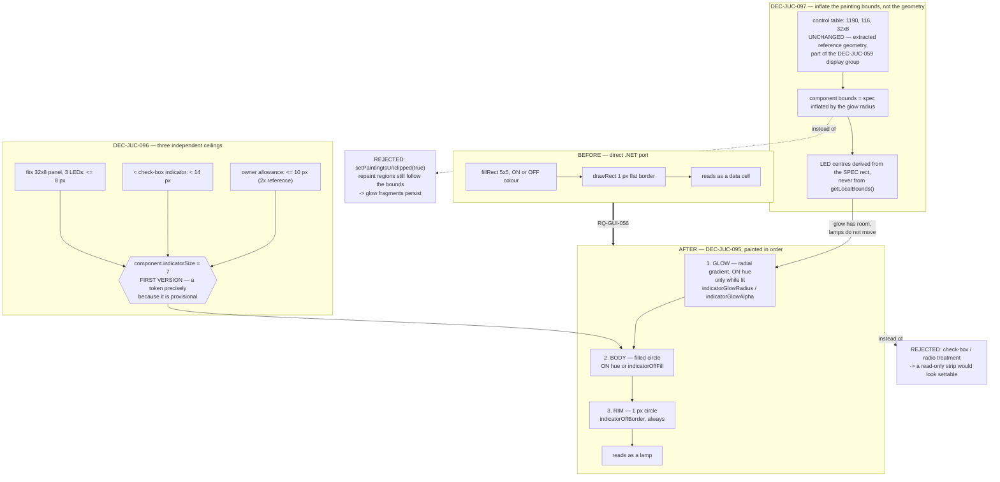

# ADR-JUC-031: MIDI LED Visual Treatment — A Lamp, Not a Control

## Status
Accepted — implemented and merged to `feature/GFX`: DEC-JUC-095/096/097
(TASK-GFX-006/007, PLAN-GFX-004). Full build clean, verified visually (round
lamps with rim, correctly positioned under the VFD glass; no live MIDI traffic
available to capture the glow, verified by code review and by the new
`LedPanelGeometryTests` size-envelope guard instead), all 6 test suites green,
0 test modified.

<!-- Motivated by RQ-GUI-056 (refined LED appearance under the VFD). Extends the
rendering half of ADR-JUC-008 (per-device MIDI LEDs) and leaves its behaviour
half — device mapping, retriggerable hold, decay timer — untouched. Consumes the
token module (ADR-JUC-014) and its generator (ADR-JUC-015); constrained by the
display-group alignment of ADR-JUC-024. -->

## Requirements
RQ-GUI-056, RQ-GUI-022, RQ-GUI-050, RQ-DSN-021, RQ-DSN-052, RQ-DSN-061,
RQ-DSN-063

## Context

The three MIDI-activity LEDs are the last surface still rendered exactly as the
.NET port left them: `fillRect` of a 5×5 square in the ON or OFF colour, plus a
flat 1 px `drawRect` border. Verified in `MainComponent::LedPanelComponent::paint`
before deciding — there is no gradient, no shape work, and no state between "off
colour" and "on colour".

That was faithful in 2013 and is now conspicuous: the strip sits directly beneath
a VFD that has since been given a recessed bezel (RQ-GUI-050, ADR-JUC-024), on a
panel whose every other control has hover and disabled treatments (ADR-JUC-017)
and block-identity colouring (ADR-JUC-018). A flat square in that neighbourhood
reads as unfinished work rather than as a deliberate minimalism.

**The geometry is unusually tight, and that drives most of this ADR.** From the
control table:

| Entry | Bounds |
|---|---|
| `_ledPanelControl` | 1190, 116, **32 × 8** |
| `_vfdDisplay` | 951, 30, 267 × 75 (glass ends y=105) |
| `btPatch*` / `btSettings` | y=121, h=15, x from 982 to 1176 |

Three consequences, all load-bearing:

1. **The panel is 8 px high.** The current LED is 5 px, centred with 1 px above
   and below. The owner's allowance of "up to 2×" (10 px) does not fit: at 10 px
   the strip overflows the height and the horizontal spacing collapses to 0.5 px
   ((32 − 30) / 4). The true ceiling from the panel is **8 px**.
2. **The display group is a computed assembly.** ADR-JUC-024 (DEC-JUC-059) lifted
   the VFD, the LED strip and the eight buttons by carefully derived offsets
   (VFD 47→30, LEDs 123→116, buttons 128→121) so the bezel clears the VCF frame
   and the gaps below it stay unchanged. Enlarging the LED panel's *bounds* in the
   control table would perturb an alignment that took a dedicated task to get
   right, and would be a recorded deviation from extracted reference geometry.
3. **There is free canvas around the strip, in a region nothing else occupies.**
   The buttons end at x=1176 and the strip starts at x=1190; the glass ends at
   y=105 and the strip at y=116. The component is transparent and
   `setInterceptsMouseClicks(false, false)`.

## Decision

- **DEC-JUC-095 — A dedicated lamp treatment; the control vocabulary is
  deliberately not borrowed.** RQ-GUI-056 offered a check-box/radio-inspired
  treatment as an alternative and it is rejected. A check box or radio says *"you
  may set this"*; an LED reports machine state the user cannot set. Giving the two
  the same visual language would make a read-only strip look editable — a
  legibility regression wearing consistency's clothes, and one that would be
  reported as a bug the first time somebody clicked an LED. Consistency is bought
  instead from the shared machinery: tokens for every value, and the same
  recessed-rim idiom the VFD bezel already established (ADR-JUC-024), which is a
  *surface* idiom rather than a *control* idiom.

  Three layers, painted in order:
  1. **Glow** — radial gradient in the LED's ON hue, drawn first, only when lit.
  2. **Lamp body** — filled circle, ON hue or OFF fill.
  3. **Rim** — 1 px circle in `indicator.offBorder`, always drawn, so an unlit lamp
     still reads as a lamp rather than as absence.

  Round, not square: the square fill is the single strongest reason the strip
  currently reads as a data cell rather than as an indicator.

- **DEC-JUC-096 — The diameter is a token, and 7 px is explicitly a first
  iteration.** `component.indicatorSize = 7`, not a `static constexpr int
  LED_SIZE = 5` in the header as today. The owner set 7 px "en première version",
  expecting to retune it after seeing it on screen; a value that is *known* to be
  provisional belongs in the design system's source of truth, where changing it is
  one YAML edit and a regeneration, not a code change.

  7 px is bounded by three independent limits, and it is worth recording that they
  do not conflict by accident:

  | Limit | Value | Source |
  |---|---|---|
  | Owner's allowance | ≤ 10 px | "jusqu'à 2× la taille de l'existant" |
  | Must stay smaller than a check box | < 14 px | `min(14, height)` in `drawToggleButton` |
  | Must fit the 32×8 panel with 3 LEDs | ≤ 8 px | control table |

  7 px satisfies all three with margin on each (1.4× the reference, half the
  check-box indicator, 1 px of horizontal spacing to spare). The binding
  constraint is the panel, not the owner's ceiling — which is why the ceiling
  alone was not a safe brief.

- **DEC-JUC-097 — The painting bounds are inflated; the LED centres and the
  control table are not.** The glow needs room the 8 px-high panel does not have.
  Rather than edit `_ledPanelControl`'s extracted bounds, `LedPanelComponent` is
  given bounds inflated by the glow radius on each side, and its painter derives
  the LED positions from the **original spec rectangle** carried as a member — so
  every lamp centre lands exactly where the reference geometry puts it, and the
  inflation is invisible except to the glow.

  *Why not enlarge the panel in the control table:* it is extracted reference
  geometry (RQ-DSN §2 puts it outside the token system), and it is part of the
  computed display-group assembly of DEC-JUC-059. Changing it to make room for a
  decoration would be a deviation to record and an alignment to re-verify, in
  exchange for nothing the inflation does not give.
  *Why not `setPaintingIsUnclipped(true)`:* it lets the glow paint outside the
  bounds, but JUCE's repaint regions still follow the bounds, so a partial repaint
  would leave glow fragments on screen. It trades a correct fix for a smaller
  diff and an intermittent artefact.
  *Consequence:* the component's bounds no longer equal its control-table spec.
  This is the one place in the app where that is true, so the painter states it
  explicitly rather than letting a later reader assume `getLocalBounds()` is the
  panel.

## Consequences

- The last unreworked surface of the panel joins the rest; an idle LED reads as an
  unlit lamp and a lit one as emitting, instead of two flat colour states.
- Three new tokens (`indicatorSize`, `indicatorGlowAlpha`, `indicatorGlowRadius`),
  all component-tier, all aliasing globals — the pattern `disabledAlpha` and
  `knobTrackAlpha` already follow. Retuning the LED after visual review is then a
  YAML edit plus `generate_design_tokens.py`, with no C++ change.
- `LED_SIZE` leaves the header. That constant was the last visual literal in this
  component, so the painter becomes fully token-driven (RQ-DSN-061).
- The component's bounds stop matching its control-table spec — a real, if local,
  break in an invariant that holds everywhere else. It is contained to one
  transparent, non-interactive component and documented at the site.
- A radial gradient per lit LED is new paint work on a component that repaints at
  30 ms *while lit only* (ADR-JUC-008). Three small gradients on a 40×20 region is
  not a cost worth engineering around, and the timer still stops when dark.
- `session.unit_tests = true`: the geometry is assertable headlessly and is where
  the real risk sits — that a future retune of `indicatorSize` silently breaks one
  of the three limits above. The visual result itself has no pixel baseline and is
  verified by owner review, as the requirement's Gherkin states.

## Alternatives Considered

- **Check-box / radio-inspired treatment** (offered by RQ-GUI-056). Rejected per
  DEC-JUC-095: it makes a read-only indicator look settable.
- **Keep squares, add only a gradient.** Rejected: the square is the main reason
  the strip reads as a data cell; a gradient inside it refines the wrong thing.
- **Grow the LEDs to the owner's full 10 px allowance.** Impossible without moving
  extracted geometry — 0.5 px spacing and a height overflow. Recorded because the
  allowance was given before the panel bounds were checked.
- **Enlarge `_ledPanelControl` in the control table.** Rejected per DEC-JUC-097:
  a recorded reference deviation plus a re-verification of the DEC-JUC-059
  display-group alignment, buying nothing over bounds inflation.
- **`setPaintingIsUnclipped(true)` instead of inflating.** Rejected per
  DEC-JUC-097: repaint regions still follow the bounds, so glow fragments persist.
- **A dedicated "LED on/off" colour pair distinct from the existing indicator
  tokens.** Rejected: the three per-device hues are already dedicated and carry
  the RQ-GUI-022 meaning; a second set would fragment that for a purely visual
  reason.

## Diagram

