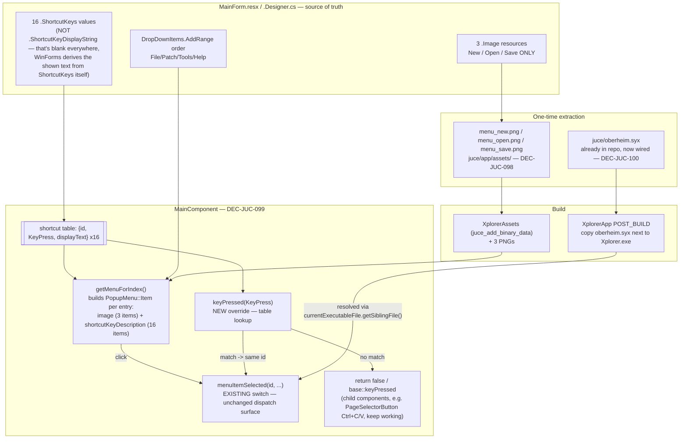

# ADR-JUC-032: Reference-Aligned Menu Bar — Icons, Order and Keyboard Shortcuts

## Status
Proposed

<!-- Motivated by RQ-GUI-008 (corrected 2026-08-04) — the menu bar's order,
labels, icons and shortcuts must match `XplorerEditor-dotnet-archive`'s
`MainForm`, verified item-by-item rather than approximated. Extends
`MainComponent`'s `MenuBarModel` implementation (RQ-GUI-008 original, ADR
none). Reuses the asset-embedding pattern of RQ-GUI-007/RQ-GUI-025 (shortcut
button GIFs, About image) and the per-component key-handling pattern of
RQ-GUI-027 (`PageSelectorButton::keyPressed`). -->

## Requirements
RQ-GUI-008, RQ-GUI-007, RQ-GUI-025, RQ-GUI-027, RQ-GUI-028, RQ-SCL-002,
RQ-SCL-003

## Context

Owner report (2026-08-04, session GFX): the JUCE menu bar's order, icons and
shortcuts do not match the reference. Verified directly against
`XplorerEditor-dotnet-archive/Xplorer/View/MainForm.Designer.cs` and
`MainForm.resx` before deciding anything — the first pass of this
verification was itself wrong (see the note on `ShortcutKeyDisplayString`
below), which is the argument for reading the designer/resx pair in full
rather than trusting either alone.

**Menu order and content, extracted from the `DropDownItems.AddRange` calls
and their resource strings:**

| Menu | Reference items (order as declared) |
|---|---|
| File | New, Open, *sep*, Save, Save as, *sep*, Exit |
| Patch | Previous, Next, Go to patch..., *sep*, Randomize, Rename, Store, Synchronize |
| Tools | Settings, Tune Request, Single patches...▸[Get all single patches from synth, Extract all single patches from file], Backup/Restore...▸[Backup all data, Restore all data] |
| Help | Xplorer help, *sep*, Check for new releases, Go to website, About... |

Current JUCE (`MainComponent::getMenuForIndex`) diverges on every menu but
Tools: File is missing "Save as" and mis-places its separator; Patch has Next
before Previous, groups the separator differently, and is missing
"Synchronize" outright; Help has only "About" — three items short. Tools
additionally carries "Piano keyboard" (RQ-GUI-028), which has no reference
counterpart at all — the same category of departure as the View menu
(RQ-SCL-002/003).

**Icons: exactly three exist, and only there.** `MainForm.resx` embeds a
`System.Drawing.Bitmap` (`.Image` resource, base64) for `newToolStripMenuItem`,
`openToolStripMenuItem` and `saveToolStripMenuItem` only. Every other menu
item in the file — all four menus, every submenu — has no `.Image` entry and
no `ImageList` is used anywhere in the form. Three 16×16 PNGs, extracted and
verified as valid PNGs (`\x89PNG` header intact, no `.NET` byte-array framing
around them): a page icon (New), a folder (Open), a floppy disk (Save).

**Shortcuts: first checked wrong, then confirmed present.** The initial pass
of this investigation grepped `MainForm.resx` for
`ToolStripMenuItem.ShortcutKeyDisplayString` and found every occurrence
empty, and concluded the reference shows no shortcuts at all. That is true of
`ShortcutKeyDisplayString` — a *display override* — but wrong as a conclusion,
because WinForms auto-generates the shown text from the separate
`ToolStripMenuItem.ShortcutKeys` property whenever the display-string override
is blank. `ShortcutKeys` **is** set, on sixteen items:

| Item | Shortcut | Item | Shortcut |
|---|---|---|---|
| New | Ctrl+N | Randomize | F8 |
| Open | Ctrl+O | Rename | F9 |
| Save | Ctrl+S | Store | F10 |
| Save as | Ctrl+Shift+S | Synchronize | F12 |
| Previous | F5 | Settings | Ctrl+G |
| Next | F6 | Tune Request | F4 |
| Go to patch... | F7 | Xplorer help | F1 |

(`toolStripPageMenuItemCopy`/`Paste` also carry Ctrl+C/Ctrl+V, but those belong
to the page right-click context menu, already ported as
`PageSelectorButton::keyPressed` under RQ-GUI-027 — unrelated to this ADR.)
Every item not listed above (Exit, Go to's/Store's/Rename's own dialogs,
About, Piano keyboard, View) has **no** shortcut in the reference, and none
is invented for it here.

**Two owner-confirmed deviations from the reference**, recorded per the
process's deviation rule rather than left as silent gaps:
1. **"Save as" is dropped.** JUCE's "Save" already unconditionally opens a
   file picker (`_shortcutActions["btPatchSave"]`, no current-file-path
   tracking exists or is planned) — it already behaves like the reference's
   "Save as", so a second, identical menu item would be redundant.
2. **"New" does not create a blank patch.** The reference's `FileOperationsManager.NewPatch()`
   loads `MainForm.DefaultToneFilename` — resolved to `oberheim.syx`, shipped
   beside the executable — through the same tone-load path as Open, and sets
   no program number itself; the file's own sysex data does. This is not a
   deviation from the reference (it is exactly what "New" does there); it is
   recorded because it is the opposite of what the name suggests.

## Decision

- **DEC-JUC-098 — Icons are the reference bitmaps, extracted once, embedded
  like every other app asset.** The three PNGs are decoded from
  `MainForm.resx` and committed to `juce/app/assets/` (`menu_new.png`,
  `menu_open.png`, `menu_save.png`), added to `XplorerAssets`
  (`juce_add_binary_data`) alongside the shortcut-button GIFs and the About
  image — the established pattern (RQ-GUI-007, RQ-GUI-025) for "this pixel
  content comes from the reference, not from this codebase's design
  language." `PopupMenu::Item::image` (a `std::unique_ptr<Drawable>`) is built
  from the matching `BinaryData::menu_*_png` at menu-build time, for these
  three items only.
  *Why not redraw as vector, matching the rest of the app's design system:*
  the design system already carries an explicit exception for reference
  photography/artwork with no vector equivalent (About's VFD photo, the
  shortcut buttons' GIF triples) — a menu icon is the same category, and
  redrawing three 16 px glyphs would produce a visible mismatch with the
  reference for a false economy (there is no token cost: three fixed bitmaps
  are cheaper than a maintained vector icon set for content nothing else
  reuses).

- **DEC-JUC-099 — Shortcuts are both displayed and functional, via one
  ID-indexed table feeding two independent JUCE mechanisms.** A single
  `constexpr` array of `{menuItemId, KeyPress, displayText}` is the source of
  truth. Building each menu's `PopupMenu::Item` sets
  `shortcutKeyDescription` from that table (display only — JUCE does not
  auto-derive it as WinForms does); a `MainComponent::keyPressed(const
  KeyPress&)` override looks the incoming key up in the same table and, on a
  match, calls `menuItemSelected(id, 0)` directly — the exact dispatcher the
  menu itself already calls, so the two paths cannot diverge in what a
  shortcut *does* versus what a click does.
  *Why not `juce::ApplicationCommandManager`* (JUCE's built-in
  command/shortcut framework, which gives both display and dispatch for
  free): it requires each action to become an `ApplicationCommandInfo` behind
  an `ApplicationCommandTarget`, a parallel dispatch surface next to the
  existing integer-id `switch` in `menuItemSelected`. Adopting it here would
  mean either running two dispatch mechanisms side by side or migrating every
  existing menu id to it in the same change — real scope creep against a bug
  report about *matching a reference*, not re-architecting command
  dispatch. The table keeps one dispatcher and adds the minimum needed for
  shortcuts to exist.
  *Why `ModifierKeys::commandModifier`, not a literal `ctrlModifier`:* matches
  `PageSelectorButton::keyPressed`'s existing convention (RQ-GUI-027) — Ctrl
  on Windows/Linux, Cmd on macOS — so a future macOS build does not need this
  table revisited.

- **DEC-JUC-100 — "New" loads the repository's `oberheim.syx`, copied next to
  the executable at build time, resolved the same way the reference resolves
  it.** `juce/oberheim.syx` (already present in the repository, currently
  unused by any build target) is copied to `$<TARGET_FILE_DIR:XplorerApp>` by
  a post-build step on the `XplorerApp` target. At runtime, "New" resolves
  `juce::File::getSpecialLocation(currentExecutableFile).getSiblingFile("oberheim.syx")`
  — the direct JUCE equivalent of the reference's
  `Path.Combine(ExecutableDirectory, "oberheim.syx")` — and passes it to the
  existing `XpanderController::loadTone`, the same entry point Open already
  uses.
  *Why a loose copied file, not `BinaryData`:* every other embedded asset is
  an image or font consumed as in-memory bytes; `loadTone` takes a filesystem
  `std::string filename` and opens it via `std::ifstream` (verified in
  `XpanderToneIO.cpp`) — there is no in-memory overload. Embedding the sysex
  as `BinaryData` would mean writing it back out to a temp file before every
  "New", to satisfy an API that already accepts a plain path; copying the one
  file the reference also ships loosely is simpler and matches its own
  resolution strategy exactly.

- **DEC-JUC-101 — Synchronize and the three Help actions call existing or
  trivial JUCE facilities; no new controller work.** "Synchronize" calls
  `XpanderController::sendProgramChangeAndGetSinglePatchFromSynth` — already
  implemented and already used by Goto/Store (`menuItemSelected` cases 12/13).
  The three Help items call `juce::URL(url).launchInDefaultBrowser()` with the
  same three URLs the reference's `XplorerConstants` defines (user manual,
  GitHub releases, project website) — no networking or update-check logic,
  identical to the reference's own `OpenBrowserWithUrl`.

## Consequences

- Every menu but View now matches the reference exactly in content and order;
  Piano keyboard is the only other sanctioned departure, unchanged in
  position.
- Three new binary assets in `XplorerAssets`; `MainComponent`'s menu-building
  code gains icon construction for exactly three items and shortcut-table
  lookups for sixteen.
- A `keyPressed` override on `MainComponent` is new surface area: it must
  claim exactly the sixteen combinations in the table and forward everything
  else, so it cannot swallow a keystroke meant for a focused child control
  (e.g. text entry in a combo, or `PageSelectorButton`'s own Ctrl+C/Ctrl+V).
  `Component::keyPressed` return semantics (`true` = consumed) are what
  prevents that: any key not in the table returns `false`/falls through to
  the base implementation.
- `XplorerApp`'s build gains one post-build copy step, its first. Packaging
  (however it happens later) must carry `oberheim.syx` alongside the
  executable, exactly as the reference's own installer would have.
- `session.unit_tests = true`: the shortcut table (id ↔ KeyPress ↔ display
  text) and the icon set are the two mechanically checkable facts here — a
  headless test can assert the table's contents against the sixteen reference
  values without needing a display. The menu's visual result (icon rendering,
  actual dropdown appearance) has no pixel baseline and is verified by
  launching the app, per RQ-GUI-008's Gherkin.

## Alternatives Considered

- **Redraw the three icons as vector glyphs, consistent with the app's design
  language.** Rejected per DEC-JUC-098: the design system already carves out
  reference bitmaps as an exception for exactly this kind of content, and a
  redraw would itself be a visible mismatch with the reference this ADR
  exists to restore.
- **`ApplicationCommandManager` for shortcuts.** Rejected per DEC-JUC-099:
  correct in principle, but a parallel dispatch surface next to the existing
  `menuItemSelected` switch — out of proportion to a reference-matching bug
  fix.
- **Embed `oberheim.syx` as `BinaryData` and write it to a temp file on
  "New."** Rejected per DEC-JUC-100: adds a temp-file write to satisfy an API
  that already accepts a plain path; the loose-file copy the reference itself
  uses is simpler and needs no extra machinery.
- **Give "New" a real blank-patch reset**, matching what the label implies
  rather than what the reference does. Rejected — explicitly, by the owner:
  the reference's behaviour (load the bundled default patch) is what
  "matching the reference" means here, however the label reads.
- **Keep "Save as" for menu-shape parity, wired to the same action as
  Save.** Rejected — owner-confirmed: a menu item that does exactly what its
  neighbour does is not parity, it is a redundant control that a future
  reader would have to explain.

## Diagram

