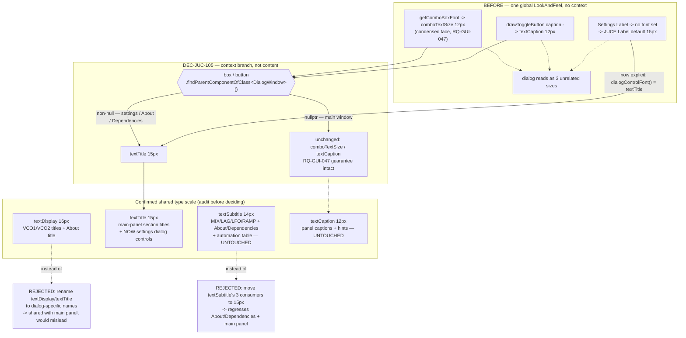

# ADR-JUC-033: Settings Dialog Control Text Sizing — Context, Not Content, Picks the Size

## Status
Accepted (owner, session GUI, 2026-08-06). Implemented: DEC-JUC-105.

## Requirements
RQ-GUI-061, RQ-GUI-047, RQ-GUI-036, RQ-GUI-058, RQ-GUI-059, RQ-GUI-060,
RQ-GUI-069, RQ-DSN-011, RQ-DSN-061

**Referenced (not amended) by RQ-GUI-069** (2026-08-15, session GUI, Tier S,
no new decision): the Randomizer page's VCO2-random/Matrix-random checkbox
columns now share a width per column instead of each row sizing its own —
a layout fix on the same page this ADR's font-sizing decision covers, not a
revision of DEC-JUC-105.

## Context

The owner reported that combo boxes, check boxes and radio buttons in the
settings dialog (MIDI / User interface / Randomizer pages) render noticeably
smaller than the row labels beside them — e.g. "Smart all notes off"'s caption,
the knob-behaviour radios, the randomizer's "FM"/"Noise"/"Sync" checkboxes.

Reading `XplorerLookAndFeel` and `SettingsDialog.cpp` before deciding anything:

- `XplorerLookAndFeel` is the **single, application-wide** `LookAndFeel`
  (`juce::LookAndFeel::setDefaultLookAndFeel`, `MainComponent.cpp`) and is
  declared `final` — there is no second implementation anywhere in the tree.
- `getComboBoxFont` always returns `comboFont()`: the embedded condensed
  typeface at `comboTextSize` (12px), fixed by RQ-GUI-047/ADR-JUC-022 for the
  main panel's tight, fixed-width combo boxes — and, because the `LookAndFeel`
  is global, applied identically to every combo box in the settings dialog too,
  where there is no such width constraint.
- `drawToggleButton` sizes its caption at `textCaption` (12px) — tuned so short
  main-panel captions like "TRI" fit a 17px-ish control row without
  ellipsizing (RQ-GUI-032/038) — again applied unmodified to the settings
  dialog's 28px rows.
- Every settings-page row-caption `Label` (`MidiSettingsPage`,
  `UiSettingsPage`, `RandomizerSettingsPage`) had **no explicit font at all** —
  an un-owned implicit default, which JUCE's own `Label.h` fixes at 15px
  (`Font font { withDefaultMetrics(FontOptions{15.0f}) }`, confirmed in the
  vendored source rather than assumed).

So three different, none-of-them-chosen sizes were on screen in the same
dialog: 12px combos, 12px checkbox/radio captions, ~15px labels.

**A full token audit, because the owner asked whether a fix here should also
touch About/Dependencies/Go-to-patch:**

| Token | Value | Every consumer found |
|---|---|---|
| `textDisplay` | 16px | Main panel VCO1/VCO2 titles (`BackgroundRenderer`); About dialog's "Xplorer" title |
| `textTitle` | 15px | Main panel section titles (`BackgroundRenderer`) — **no dialog consumer before this ADR** |
| `textSubtitle` | 14px | Main panel MIX/LAG/LFO/RAMP labels (`BackgroundRenderer`); About/Dependencies body text (RQ-GUI-025); the settings dialog's own automation-table cell text (RQ-GUI-036) |
| `textCaption` | 12px | Main panel parameter captions; settings-page hint lines; every checkbox/radio caption app-wide (pre-existing) |

This is a single 16/15/14/12 type scale shared by the main panel diagram and
every dialog — not per-dialog names — so `textDisplay`/`textTitle` cannot be
renamed to something About-specific without misdescribing their main-panel
use, and `textSubtitle` already has three working consumers this task must
not disturb. Go-to-patch/Store and Rename have no combo box, check box or
radio button at all (a `Slider` spinner and a `TextEditor` respectively) — out
of scope by the requirement's own wording, confirmed by reading `Dialogs.cpp`.

## Decision

- **DEC-JUC-105 — A context branch inside the one `LookAndFeel`, not a second
  `LookAndFeel`; `textTitle` (15px) for every settings-dialog `Label`, combo
  box and checkbox/radio caption.**
  - `getComboBoxFont(ComboBox& box)` and `drawToggleButton`'s caption sizing
    both call `box`/`button.findParentComponentOfClass<juce::DialogWindow>()`.
    Non-null (every settings/About/Dependencies surface, all opened via
    `juce::DialogWindow::LaunchOptions`) selects `textTitle`; null (the main
    window, a plain top-level component, never a `DialogWindow`) keeps the
    exact pre-existing behaviour. This is **still exactly one fixed size per
    surface, chosen by context, never by the control's own content** — so
    RQ-GUI-047/DEC-JUC-046's rule against per-box content-based sizing is
    extended, not violated: two surfaces, two constants, zero measurement.
  - `MidiSettingsPage`/`UiSettingsPage`/`RandomizerSettingsPage`: every
    row-caption `Label` (device/channel/synth-type/delay labels, the
    automation-table caption, the knob-LED/movement/style labels, the eight
    block-colour labels, the randomizer's frequency/detune/envelope/VCO2/
    matrix labels) now calls `.setFont(dialogControlFont())`, a single helper
    aliasing `textTitle` — closing the "implicit default" gap at the same
    time as the size mismatch, per the design-system rule that no visual
    value may be un-owned.
  - `textTitle` was picked over introducing a new semantic name because it
    already exists, already equals 15px (JUCE's own prior `Label` default —
    so the labels are visually unchanged), and had zero dialog consumers to
    collide with.
  - `textSubtitle`, `textDisplay` and `textCaption` are **not renamed and not
    reassigned** — every one of their pre-existing consumers (listed in
    Context) is untouched.
  - Hint lines (`_unityHint`, `_blockHint`) keep `textCaption` — a
    deliberately smaller, secondary style, not "the other labels."
  - `TextButton`s (`Reset to defaults`, `Choose...`, `Randomize all`, OK/
    Cancel, `Export as HTML`, …) are untouched — the requirement's Statement
    names combo boxes, check boxes and radio buttons only.

## Consequences
- Every settings-dialog combo box, check box and radio button now reads at
  the same size as its own row label; the label itself is pixel-identical to
  before (15px either way), so the only visible change is the controls
  growing from 12px to 15px.
- The main window is provably unaffected: `findParentComponentOfClass<DialogWindow>()`
  is null there, so `getComboBoxFont`/`drawToggleButton` take the exact same
  branch as before this ADR — RQ-GUI-047's main-panel guarantee is untouched.
- `textSubtitle`'s three consumers (main-panel MIX/LAG/LFO/RAMP, About/
  Dependencies, the automation table) are untouched — no regression risk in
  either direction from this decision.
- The type-scale token names stay as they were; a later, purely cosmetic
  renaming pass (raised by the owner, deferred) is now understood to require
  touching `BackgroundRenderer.cpp` as well as every dialog, since the names
  are shared — should not be done as a side effect of an unrelated task.
- No unit test: pure `LookAndFeel`/JUCE widget configuration with no
  headless-testable logic, same precedent as TASK-GUI-014/TASK-GUI-016.

## Alternatives Considered
- **A second `LookAndFeel` subclass for dialogs**, set via `Component::setLookAndFeel`
  on the settings dialog. Rejected: `XplorerLookAndFeel` is `final` by design,
  and a subclass would exist only to override two methods while duplicating
  or delegating everything else (tick box, radio circle, combo border/arrow)
  it must still draw identically — more moving parts for the same outcome as
  a context check already reachable from the component itself.
- **Rename `textDisplay`/`textTitle` to dialog-specific names** (e.g.
  `textAboutTitle`). Rejected once the audit showed both are shared with the
  main panel's `BackgroundRenderer` — the names would misdescribe their most
  visible use.
- **Standardise everything, including `textSubtitle`'s existing consumers, on
  15px.** Considered and rejected by the owner: it would change the main
  panel's MIX/LAG/LFO/RAMP labels and the already owner-confirmed About/
  Dependencies body text (RQ-GUI-025) as a side effect of a settings-dialog
  fix — out of scope and not requested.
- **Per-box content-based font sizing in the settings dialog** (fit each
  combo/label to its own longest value). Rejected: reintroduces exactly the
  per-instance variance RQ-GUI-047/DEC-JUC-046 eliminated on the main panel,
  for a dialog that does not need it — a single fixed size is enough since
  every settings-page row has ample width.

## Diagram

