# ADR-JUC-034: Section Separator — One Rule Interrupted by Its Label

## Status
Accepted (owner, session GUI, 2026-08-08). Implemented: DEC-JUC-107, DEC-JUC-108,
DEC-JUC-109, DEC-JUC-110.

**Extended (not superseded) 2026-08-10 by ADR-CLR-001.** This ADR decides what a
separator *looks like* and how its parts align to each other. It does not decide
*where the separator sits vertically* relative to the blocks around it —
ADR-CLR-001 does, via `tokens::component::sectionGapAbove`. The two are
complementary: DEC-JUC-107's "the label names the section that just ended" is
precisely the premise RQ-CLR-001 turns into a measurable placement rule. Nothing
in DEC-JUC-107..110 changes.

<!-- Motivated by RQ-GUI-062 (section separator drawn as an interrupted rule) and
RQ-DSN-101 (its token group). Builds on ADR-JUC-013 (mockup-first vector
background pipeline), ADR-JUC-014 (token module) and ADR-JUC-018 (block-identity
colours in the painter, which owns the section header's colour). -->

## Requirements
RQ-GUI-062, RQ-DSN-101, RQ-GUI-037, RQ-GUI-044, RQ-DSN-063, RQ-DSN-092

## Context

The owner reported that the interface — the middle column above all
(VCF/VCA → ENV X → LFO X → RAMP X) — carries controls over its full height and
reads as cramped, and asked for more "air" **without touching the structure of
the functional blocks**.

The section header was a candidate because it spent two text rows on one piece
of information: a label, then a separate rule ~11 px below it, ~22 px of header
per section across eight sections. Nothing anchors to the label's own row — the
rule is what block geometry aligns to — so collapsing the two onto one row is
invisible to every other element.

Three constraints framed the design:

1. **The rule's right end may not move.** Block boundaries and, for the matrix,
   a control column align to it. Only the header's internal composition was in
   play.
2. **The mockup is the review surface** (ADR-JUC-013): every iteration had to be
   visible in `background-mockup.svg` before `BackgroundRenderer.cpp` changed.
   The generator and the painter therefore had to agree on the geometry — which
   is what forced the values into tokens rather than leaving them as literals on
   each side.
3. **JUCE has no cap-height metric.** The chosen visual (a rule as tall as the
   label's capitals) is not directly expressible through the `juce::Font` API,
   and the obvious substitute is wrong in a way that is easy to miss.

The design converged over four owner reviews rather than in one step, and two of
those reviews **rejected** an implemented version. Both rejections are recorded
below, because each one is the reason a decision reads the way it does.

## Decision

### DEC-JUC-107 — The label interrupts the rule; the two are bottom-aligned

The header is one row: the rule runs from the section's x, is interrupted by the
label, and resumes to its unchanged right end. The label's **baseline** sits on
the rule's **bottom edge** — these labels are caps, digits, space and `/`, so
nothing descends below the baseline and "baseline" and "bottom of the letters"
coincide.

*Rejected first:* centring the label's cap band on the rule's thickness. On
review the rule read as **crossing** the text, and the letters hung ~3 px below
the line they were meant to rest on. Bottom alignment was adopted in its place;
the rule's top edge stays fixed, so the change is invisible to everything below.

The single token `sectionBarHeight` expresses the baseline offset below the
rule's top edge. It formerly meant "rule thickness" and is now **only** the
baseline offset (DEC-JUC-109 took thickness away from it) — the same number,
a different and now load-bearing role, which is why RQ-DSN-101 promotes it from
a bare constant to a token.

### DEC-JUC-108 — A lead-in stub before the label, and `MOD MATRIX`

Two changes made for the same reason — the Xpander's silkscreen idiom:

- **Lead-in stub.** A rule that merely starts after its label reads as an
  underline that lost its beginning. A short stub before the label (token
  `sectionLeadStub`, ≈1.5 average cap advances) restores the reference's own
  treatment, where the rule runs *into* the section name. **One fixed length for
  all eight sections**, not 1.5 of each label's own characters: a per-label stub
  would leave each rule starting at a different x and break the column's left
  alignment.
- **`MOD MATRIX`** replaces `MODULATION MATRIX`. At 17 characters it was more
  than twice every other label, and once the label interrupted the rule it left
  that section almost no rule. A deliberate wording deviation from the reference
  silkscreen, recorded rather than silently abbreviated.

The stub is **flat block hue at full opacity**; only the run *after* the label
carries the existing fade (RQ-GUI-037, RQ-DSN-092). This is exact, not
approximate: the fade's first stop is full opacity, so stub and run meet at the
same value and the interrupted rule reads as one object. A continuous gradient
spanning the whole header was considered and is unnecessary — over a 16 px stub
the fade would span 1.00 → 0.97.

### DEC-JUC-109 — The rule's thickness is the label's cap height, MEASURED

The rule is as tall as the capitals in front of it, so it reads as a band level
with the label rather than as an underline. The thickness is obtained by
measuring the **outline** of a reference `'H'` (`GlyphArrangement::createPath`,
then the path's bounds): `'H'` is flat-topped at the cap height and sits on the
baseline, so its outline height *is* the cap height.

*Rejected first:* `GlyphArrangement::getStringBounds(...).getHeight()`, which
looks like the label's ink height and is not. `PositionedGlyph::getBounds()` is
built from `font.getHeight()` — the full line box, ascent **plus** descent — so
at 15 px it returns ~15 px where the cap height is ~10.7 px. The owner saw the
result immediately ("la barre est bien plus haute que le texte"); nothing in the
API name signals the difference.

Two properties of this decision are deliberate:

- **One fixed reference glyph, not each label's own ink.** Measuring the label
  itself would make `VCF/VCA` (whose `/` overshoots the cap height) taller than
  `LAG`. All eight rules share one thickness.
- **Measured, not stored** (RQ-DSN-101). A stored thickness is a second source
  of truth that a font or size change silently invalidates, and the failure mode
  — a rule that no longer matches its label — is exactly the defect this
  decision was made to fix. The SVG mockup, having no font engine, substitutes
  the published Helvetica/Arial Bold ratio (0.716 em) and says so at the site.

### DEC-JUC-110 — The matrix rule stops at the quantize column

The `MOD MATRIX` rule ends flush with the right edge of the modulation matrix's
quantize check-box column (control-table `MOD_QUANTIZE_n`: x=1206, width=12 →
1218; less the section's x=958 → a 260 px rule) instead of overrunning it by
8 px, as the inherited shared width did.

The matrix is the **only** section whose rule runs alongside a control column;
every other section keeps `SECTION_BAR_WIDTH`. The derivation is documented at
both call sites rather than resolved from the control table at run time: the
painter transcribes geometry from the owner-validated mockup and does not query
the table (ADR-JUC-013), and the SVG generator could not follow it there — a
run-time lookup on one side only would break the lock-step the two are held in.

## Consequences

**Easier.** Each section header now occupies ~11 px instead of ~22 px, freeing
~11 px per section across eight sections, with no other element moved: the
rule's y and right end are unchanged, so block geometry, connector routing and
every control position are untouched. The freed height is available for the
redistribution the owner asked about — that is separate work, deliberately not
done here.

**Harder / constrained.**

- **The label must be measured.** The stacked layout never needed its width; the
  rule's start now depends on it. Both sides measure: `GlyphArrangement::`
  `getStringWidth` in the painter, published advance widths in the generator.
  The two agree to within a pixel, which is the accuracy the mockup claims.
- **A second measured quantity, cap height, has no JUCE API.** It costs a
  `Path` construction per section per repaint (eight paths), which is
  negligible against the diagram's own stroke count, and it is the price of not
  storing a value that can go stale.
- **Two implementations to keep in step.** The generator and the painter now
  share three tokens, which removes the values as a divergence risk but not the
  *layout logic* — `section()` exists twice, in Python and in C++, and a change
  to one must be made in the other. That is the pre-existing ADR-JUC-013 bargain,
  not something this ADR introduces; it is noted because this change made both
  copies more intricate.
- **The header is now width-sensitive.** A label long enough to reach the rule's
  right end would leave no rule at all. `MOD MATRIX` (DEC-JUC-108) is the case
  that surfaced it, resolved by shortening the label. Nothing enforces this —
  a future long label would be caught by review, not by a check.

**Not in scope.** Redistributing the reclaimed height between blocks; any change
to block geometry, control positions or the control table.

## Alternatives Considered

- **Keep the stacked layout, shrink the gap between label and rule.** Rejected:
  it saves a few pixels of the ~11 available and leaves the header a two-row
  element, which is the actual cost.
- **Centre the label's cap band on the rule** (DEC-JUC-107). Implemented, shown
  in the mockup, rejected by the owner: the rule reads as struck through the
  text.
- **Rule thickness from `getStringBounds().getHeight()`** (DEC-JUC-109).
  Implemented, shipped to a build, rejected on sight: it is the font's line box,
  not the label's cap height.
- **Rule thickness as a stored token.** Rejected by RQ-DSN-101: a second source
  of truth for a value derivable from the typeface, whose staleness is silent.
- **A continuous fade across the whole header, stub included.** Rejected as
  unnecessary: over a 16 px stub the gradient spans 1.00 → 0.97, and it would
  have required per-section user-space gradients in the SVG for no visible gain.
- **Per-label lead-in stub length (1.5 of *that* label's characters).**
  Rejected: the eight rules would start at eight different x offsets.
- **Resolve the matrix rule's end from the control table at run time**
  (DEC-JUC-110). Rejected: the painter does not query the table for diagram
  geometry, and the SVG generator cannot, so only one of the two lock-stepped
  implementations could have done it.

## Diagram

```mermaid
flowchart TB
    subgraph SOT["Single source of truth"]
        Y["design-tokens.yaml<br/>sectionBarHeight · sectionLabelGap · sectionLeadStub<br/><i>RQ-DSN-101</i>"]
    end
    Y -->|generate_design_tokens.py| H["DesignTokens.hpp<br/><i>--check guards drift</i>"]
    Y -->|resolve&#40;&#41;| P["generate_background_mockup.py"]
    H --> C["BackgroundRenderer.cpp<br/>section&#40;&#41;"]
    P --> SVG["background-mockup.svg<br/><i>owner review surface</i>"]
    SVG -.->|"validated → propagate"| C

    subgraph HDR["Header composition — DEC-JUC-107/108"]
        direction LR
        S["lead-in stub<br/>flat hue, full opacity<br/><i>sectionLeadStub</i>"]
        G1["gap"]
        L["LABEL<br/>baseline = rule bottom"]
        G2["gap"]
        R["rule, faded to its end<br/><i>right end unchanged</i>"]
        S --- G1 --- L --- G2 --- R
    end
    C --> HDR

    subgraph TH["Rule thickness — DEC-JUC-109"]
        M["measure 'H' outline<br/>GlyphArrangement::createPath"]
        X["✗ getStringBounds&#40;&#41;.getHeight&#40;&#41;<br/>= font line box, NOT cap height"]
    end
    C --> M
    M -.->|rejected| X
```

