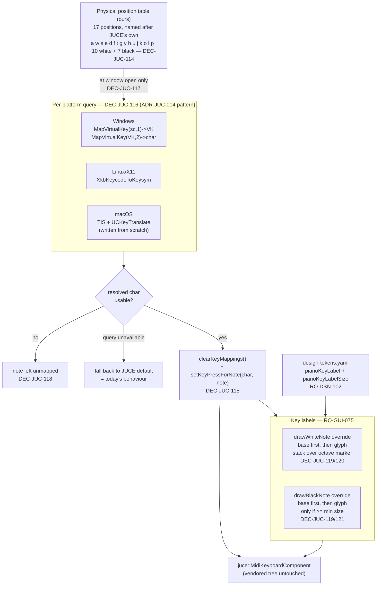

# ADR-JUC-035: Layout-Independent Computer-Keyboard Mapping for the Piano Window

## Status
Accepted — implemented (2026-08-18, session GUI): TASK-GUI-032 (tokens),
TASK-GUI-033 (mapping resolution seam), TASK-GUI-034 (key labels). Windows
and macOS `KeyboardLayoutQuery` implementations are unverified by compilation
in this session (no toolchain available) — CI is their first real build.

<!-- Motivated by RQ-GUI-074 (mapping resolved from physical key positions),
RQ-GUI-075 (the resolved character printed on the key) and RQ-DSN-102 (the two
label tokens). Extends RQ-GUI-028's piano window. Reuses the per-platform seam
pattern established by ADR-JUC-004 for the MIDI backend. -->

## Requirements
RQ-GUI-074, RQ-GUI-075, RQ-DSN-102

## Context

`PianoWindow` (`juce/app/src/PianoWindow.cpp`) instantiates a bare
`juce::MidiKeyboardComponent` and configures no key mapping at all, so the
mapping is entirely JUCE's default, set in its constructor
(`juce_MidiKeyboardComponent.cpp:44-48`):

```cpp
// initialise with a default set of qwerty key-mappings.
const std::string_view keys { "awsedftgyhujkolp;" };
for (const char& c : keys)
    setKeyPressForNote ({c, 0, 0}, (int) std::distance (keys.data(), &c));
```

Those seventeen characters are chosen so that, **on a US QWERTY keyboard**, the
home row draws the white keys and the upper row the black ones, with gaps where
a piano has no black key. It is a sound idea expressed in the wrong currency.

What the code imposes:

- **JUCE matches characters, and resolves them through the active layout.**
  `MidiKeyboardComponent::keyStateChanged` polls
  `KeyPress::isCurrentlyDown()`, which reaches
  `KeyPress::isKeyCurrentlyDown(keyCode)`; on Windows that is
  `VkKeyScan((WCHAR) keyCode)` (`juce_Windowing_windows.cpp:5702`), i.e. *"which
  physical key produces this character on the current layout?"*. JUCE therefore
  finds the right key — but the character it looks for only lands in the piano
  shape on QWERTY. On AZERTY, `a` is the upper-row key labelled `A`, so C moves
  off the home row and both rows stop reading as rows (owner report).
- **`KeyPress` has no physical/scancode concept.** `juce_KeyPress.h` contains no
  scancode, no HID usage, no "physical" anything. The public API is
  character-only, so a physical mapping cannot be expressed by handing JUCE a
  different kind of key.
- **The mapping is nevertheless fully overridable.** `clearKeyMappings()`,
  `setKeyPressForNote()` and `setKeyPressBaseOctave()` are public
  (`juce_MidiKeyboardComponent.h:122-154`). Only the *default* is hard-coded.
- **The OS translation we need is already in JUCE's own backends.** Windows
  calls the exact position→character pair we need
  (`MapVirtualKey(scancode, 1)` → VK, then `MapVirtualKey(vk, 2)` → character,
  `juce_Windowing_windows.cpp:3353-3354`); Linux already loads
  `XkbKeycodeToKeysym` (`juce_XSymbols_linux.h:313`). macOS uses neither — its
  backend has no `UCKeyTranslate` call anywhere.
- **White-key text is a supported extension point; black-key text is not.**
  `drawWhiteNote` already renders `getWhiteNoteText(midiNoteNumber)` in
  `findColour(textLabelColourId)` (`juce_MidiKeyboardComponent.cpp:375-391`),
  and `getWhiteNoteText` is `virtual`. `drawBlackNote` draws no text at all —
  but it is `virtual` too, so it can be extended rather than replaced.

## Decision

- **DEC-JUC-114 — Invert the question: positions are ours, characters are the
  OS's.** The application owns a fixed table of **seventeen physical key
  positions** — the same shape JUCE's own default already draws (ten white
  keys on the home row, seven black keys on the row above, skipping the
  Mi–Fa/Si–Do slots) — and asks the OS, at window open, which character each
  position currently produces. Those resolved characters are then handed to
  JUCE's existing character-based `setKeyPressForNote()`. **Each position is
  named after JUCE's own reference letter for it** (`a w s e d f t g y h u j k
  o l p ;`) rather than after an invented row/column index: the name is only
  ever used to look up that platform's layout-independent scancode/keycode for
  "the key physically labelled that way on a US keyboard", never matched as a
  character. This makes the QWERTY acceptance case (DEC-JUC-118) trivially
  true — the position names and JUCE's default are the same seventeen
  letters — instead of something to re-derive. The piano shape becomes a
  constant expressed in physical geometry; the characters become a runtime
  result. Enumerating layouts (AZERTY, QWERTZ, Dvorak, …) is explicitly
  rejected: it is unbounded, and this approach covers layouts nobody listed.
  (RQ-GUI-074)

- **DEC-JUC-115 — No JUCE patch, and no scancode in JUCE's API.** Because we
  compute the characters ourselves, JUCE needs no physical-key concept and the
  vendored tree stays untouched — which keeps the pinned-JUCE upgrade path clean
  (ADR-JUC-001). The mapping is installed with `clearKeyMappings()` followed by
  fifteen `setKeyPressForNote()` calls. (RQ-GUI-074)

- **DEC-JUC-116 — One per-platform seam, mirroring `MidiBackend`.** The query
  *"which character does physical position P produce?"* is the whole of the
  platform-dependent surface. It sits behind one narrow interface with three
  implementations — Windows (`MapVirtualKey`, the pair JUCE already calls),
  Linux/X11 (`XkbKeycodeToKeysym`, already loaded by JUCE), macOS
  (`TISGetInputSourceProperty` + `UCKeyTranslate`, **the only one written from
  scratch**, since JUCE's macOS backend does not do this translation). This is
  the same shape ADR-JUC-004 gave the MIDI backend, for the same reason: it
  makes the layout-independent half unit-testable against a fake, with no
  display and no real keyboard. (RQ-GUI-074, ADR-JUC-004)

- **DEC-JUC-117 — Resolve once, at window open; a mid-session layout switch is
  out of scope.** *(Owner decision, 2026-08-17: "le type qui change son clavier
  avec le piano ouvert franchement il cherche les ennuis.")* No layout-change
  listener, no re-query on focus. Reopening the window re-resolves. This is
  recorded as a deliberate limitation, not an oversight: tracking it would mean
  a platform-specific notification on all three OSes for a case with no real
  user. (RQ-GUI-074)

- **DEC-JUC-118 — Degrade to fewer bindings, never to wrong ones.** A position
  resolving to no usable printable character leaves that note **unmapped**; a
  platform where the query is unavailable falls back to **JUCE's built-in
  default**, i.e. exactly today's behaviour. The failure modes are ordered so
  the window is never worse than it is now, and never silently plays a note the
  user did not aim for. (RQ-GUI-074)

- **DEC-JUC-119 — Labels: extend JUCE's two painters, do not reimplement them.**
  White keys go through `getWhiteNoteText()`, the hook JUCE already provides and
  already renders. Black keys override `drawBlackNote()` and **call the base
  implementation first**, then draw the character on top — so JUCE keeps
  ownership of the key's appearance (fill, pressed state, hover overlay,
  bevel) and this ADR owns only the glyph. Copying JUCE's ~30-line body to
  insert one `drawText` is rejected: it would silently freeze this key's look at
  the pinned JUCE version. (RQ-GUI-075)

- **DEC-JUC-120 — On the two Cs inside the mapped span, stack rather than
  choose.** Those keys carry both an octave marker and a binding: the marker
  stays where JUCE draws it (bottom of the key) and the binding character is
  drawn above it. *(Owner decision, 2026-08-17.)* Letting the binding replace
  the marker was rejected — it would make two Cs read differently from every
  other C on the keyboard, which costs more orientation than it buys. This means
  `getWhiteNoteText()` alone is insufficient for those two keys (it yields one
  string in one place), so white keys with a binding are drawn by overriding
  `drawWhiteNote()` on the same call-the-base-first principle as DEC-JUC-119.
  (RQ-GUI-075)

- **DEC-JUC-121 — Black-key labels are conditional on a stated minimum size.**
  Below it, black-key labels are dropped and only white keys are labelled.
  *(Owner decision, 2026-08-17: "on peut se limiter aux touches blanches,
  l'utilisateur devrait comprendre.")* The threshold is a number in the code
  compared against the rendered key width — not a judgement made by eye at
  review time — so the behaviour is the same on every machine and every window
  size. A partial mapping the user can read is preferred to a complete one they
  cannot. (RQ-GUI-075, RQ-DSN-102)

## Consequences

- **Easier:** the mapping is correct on layouts nobody enumerated, including
  future ones; the piano shape is stated once, in one table, in the currency it
  actually lives in; the resolution logic is a pure function of
  (position table, query result) and so is unit-testable headlessly against a
  fake layout; the printed characters make the window self-documenting, which
  removes the "no discernible logic" report at its root rather than by adding a
  help page.
- **Harder / constrained:** a new per-platform seam to carry (three
  implementations, one of them — macOS — written from scratch and only
  verifiable on a Mac); `PianoWindow` grows from a 37-line file into a component
  with two paint overrides; the CI cannot prove the macOS path, so it needs an
  owner check on a real Mac before RQ-GUI-074 can be called met there.
- **Neutral:** no change to what a key plays (RQ-MID-010), to the window's
  geometry, to mouse play, or to the US QWERTY result — which resolves to the
  same seventeen characters JUCE hard-codes today, so US users see no
  difference at all.

## Alternatives Considered

- **Ship a table per layout (AZERTY, QWERTZ, Dvorak, …), chosen by a setting or
  by detection:** rejected. It is unbounded by construction — the owner's
  objection, 2026-08-17, was exactly that there are not only two layouts — and
  every layout not on the list stays broken. It also puts a keyboard-layout
  question in a synthesiser editor's settings dialog, which is a support burden
  for something the OS already knows.
- **Patch the vendored JUCE to expose scancodes in `KeyPress`:** rejected. It
  buys nothing the query approach does not already give (we need characters in
  the end anyway, since `setKeyPressForNote` takes them), and it puts a local
  delta into a pinned third-party tree, which ADR-JUC-001's fetch-and-pin model
  is designed to avoid.
- **Reimplement `MidiKeyboardComponent` entirely:** rejected as grossly
  disproportionate — the component's mouse handling, drawing, state listening
  and scrolling are all correct and wanted. Only its default character list is
  wrong.
- **Drop JUCE's octave markers so the mapping characters never collide:**
  rejected — it removes orientation across the *whole* keyboard to resolve a
  collision on two keys. Superseded by DEC-JUC-120's stacking.
- **Track layout changes while the window is open:** rejected for now, see
  DEC-JUC-117 — deliberate scope limit, owner decision.

## Diagram


