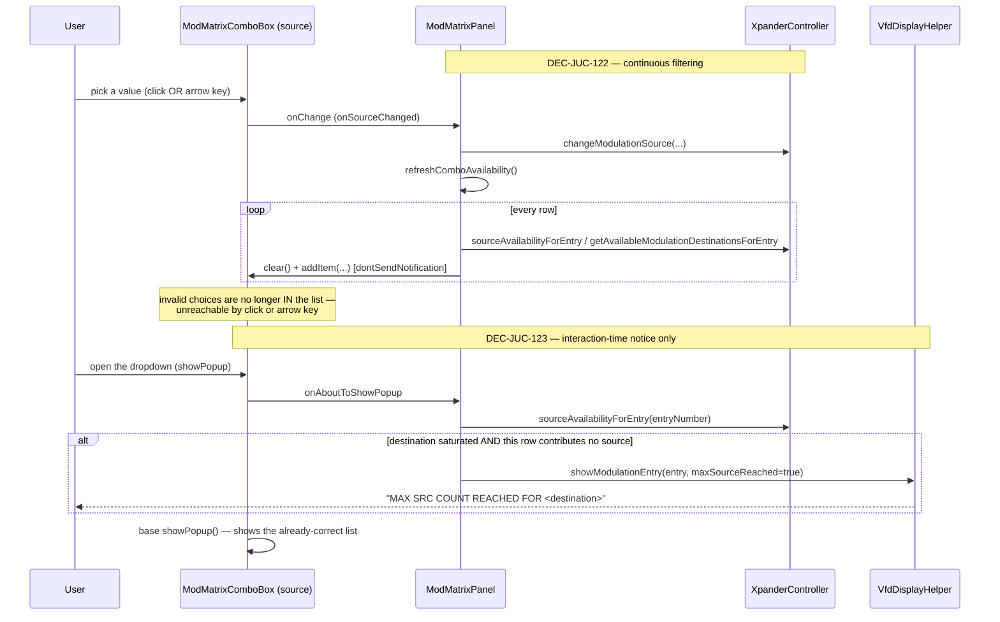

# ADR-JUC-036: Modulation-Matrix 6-Source Cap — UI Enforcement Mechanism

## Status
Accepted

## Context
The Oberheim hardware allows at most 6 active sources per modulation
destination (`XpanderConstants.MAX_MODULATION_SOURCE` = 6). The .NET
reference's controller already exposes the three methods that express this
rule — `IsMaxSourceCountForDestinationReached`, `SourceAvailabilityForEntry`,
`GetAvailableModulationDestinationsForEntry` — and the JUCE port already
carries faithful copies of all three (RQ-CTL-030). Neither the reference nor
the port enforces the rule anywhere else: the model layer
(`XpanderTone::AddModulationSource`/`addModulationSource`) skips only the
outbound SysEx when the cap is hit — it still writes the local
`entry.source`/`entry.Source` unconditionally, byte-identical in both
codebases. The rule's *entire* enforcement, in the reference, is that each
combo's item list is rebuilt when its native dropdown is about to open
(WinForms `ComboBox.DropDown`), narrowed to what the three controller methods
allow — an item that would break the cap is simply never offered.

The JUCE port had ported the three controller methods but never called any of
them from the UI (owner report, session GUI): `ModMatrixPanel` built every
combo's item list once, in full, at construction, and never touched it again.
A user could therefore assign more than 6 sources to one destination, which
the model layer would silently half-apply (local state updated, nothing sent
to the synth) — a state with no counterpart on the real hardware.

A direct, literal port of the reference's mechanism — rebuild the list only
when `juce::ComboBox::showPopup()` fires — was drafted first. It was rejected
before implementation (owner instruction) for one reason: `juce::ComboBox`
lets a focused, closed combo change its selection with the arrow keys
(`ComboBox::keyPressed` calls `nudgeSelectedItem` directly, never opening the
popup). A list that is only ever correct *after* the popup has been opened at
least once stays stale — and selectable via keyboard — the rest of the time.
WinForms `ComboBox` very likely has the same gap (arrow-key navigation on a
closed combo does not fire `DropDown` there either), but sharing a reference
limitation is not a reason to keep it once it has been noticed and the owner
has asked for it closed.

## Decision
- **DEC-JUC-122 — Continuous filtering, not dropdown-open-only.** Every
  combo's item list is rebuilt from the live controller state after every
  local edit that can change any destination's saturation
  (`onSourceChanged`, `onDestinationChanged`) and after every external
  resync (`ModMatrixPanel::refreshRow`, which both `refreshAll` and the
  single-entry synth-echo path already go through). An invalid choice is
  therefore never present in any combo's list to begin with, so it cannot be
  reached by a pointer click, an arrow key, or any other input method —
  closing the gap the dropdown-open-only design would have kept open.
  Rebuilding is `O(20)` list rebuilds of small (`<=28`-item) lists; run only
  on user edits and synth events, never per frame, the cost is immaterial.
- **DEC-JUC-123 — `ModMatrixComboBox::showPopup()` is kept, but scoped to
  the VFD notice only.** List filtering no longer depends on it (DEC-JUC-122
  makes the list correct before the popup ever opens), but the reference's
  "MAX SRC COUNT REACHED FOR `<destination>`" VFD notice
  (`VfdDisplayHelper.UpdateState(entry, maxSourceReached: true)`, already
  faithfully ported as `VfdDisplayHelper::showModulationEntry(entry, true)`
  but never called with `true`) is legitimately tied to the *interaction
  moment* — showing it on every state change, for every currently-saturated
  row regardless of which one the user is touching, would be noise, not a
  cue. `showPopup()` is JUCE's exact equivalent of WinForms' `DropDown`
  event for this one purpose: a `std::function<void()>` hook, set only on
  the source combo, checks `sourceAvailabilityForEntry` and fires a new,
  dedicated `ModMatrixPanel::setMaxSourceReachedHandler` callback — kept
  separate from the existing `setEditHandler` because the two are different
  events (an edit that happened vs. an attempted edit that could not).
- **Scope.** Destination combos get list filtering (DEC-JUC-122) but no
  `showPopup()` hook — the reference has no VFD notice for a saturated
  destination combo either (only the source-combo dropdown handler calls
  `UpdateState(..., true)`), so none is added here.

## Consequences
- The 6-source cap is now a structural invariant of every combo's item list,
  not a validation the user can route around — closes the reported defect
  for every input method, not only the one the owner happened to test.
- Two independent concerns stay decoupled: `refreshComboAvailability()` (data
  correctness, DEC-JUC-122) and the popup hook (interaction feedback,
  DEC-JUC-123) can be reasoned about, and tested, separately.
- `ModMatrixComboBox` gains one virtual override and one settable callback;
  no change to its existing block-identity/highlight state (RQ-GUI-052,
  ADR-JUC-028) or to `HoverRepaintingComboBox` (RQ-GUI-041, ADR-JUC-017).
- `ModMatrixPanel::refreshRow` now does more work per call (a full
  `refreshComboAvailability()` pass) than strictly needed for a single-entry
  external sync; accepted for the simplicity of one invariant ("after
  `refreshRow` returns, every combo's list is correct") over a finer-grained,
  harder-to-verify dependency tracking scheme, given the call frequency
  (user edits and synth events, not a render loop).

## Alternatives Considered
- **Literal port (list rebuilt only on `showPopup()`).** Matches the
  reference exactly, but leaves the arrow-key gap open on this port, which
  the owner explicitly asked to close (see Context). Rejected.
- **Validate and reject in `onSourceChanged`/`onDestinationChanged`
  instead of filtering the list.** Would close the gap too, but diverges
  further from the reference's actual mechanism (which does no validation at
  all in its `SelectedIndexChanged` handlers) and would need its own
  "selection snapped back" UX with no reference behaviour to anchor it.
  Filtering the list is closer to what the reference does and needs no new
  UX invented. Rejected.
- **Harden `XpanderTone::addModulationSource` itself (model layer) to
  reject/no-op entirely when the cap is hit, instead of writing local state
  it never transmits.** Would fix the underlying inconsistency at its root,
  but it is byte-identical reference behaviour (`AddModulationSource`,
  `XpanderTone.ModulationMatrix.cs:310-315`) that the reference's own design
  relies on the UI never reaching — changing it is a bigger, model-layer
  divergence from the reference than this defect calls for. Left as-is;
  revisit only if a path other than the UI is ever found to reach it.

## Diagram

