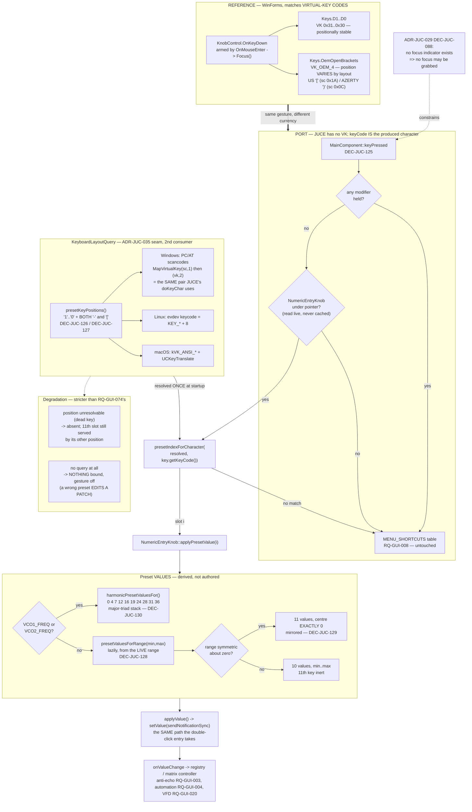

# ADR-JUC-037: Keyboard Preset-Value Entry for Rotary Knobs

## Status
Accepted — implemented 2026-08-27, session GUI (branch `feature/GUI`):
TASK-GUI-046…050, PLAN-GUI-013. Full build clean (application and both test
targets, no warnings), 179/179 CTest scenarios green, 0 test modified.
Linux and macOS position tables are **unverified by execution** — see
Consequences.

<!-- Motivated by RQ-GUI-079 (the gesture) and RQ-GUI-080 (its layout
independence). Closes the "Not in scope / deferred" keyboard preset-value item
of ADR-JUC-009. Extends the per-platform seam of ADR-JUC-035 (DEC-JUC-116) with
a second consumer. Applies ADR-BUG-001's reference-defect rule to the
reference's own distribution arithmetic. Constrained by ADR-JUC-029
(DEC-JUC-088): no focus indicator exists, so no focus may be relied upon. -->

## Requirements
RQ-GUI-079, RQ-GUI-080, RQ-GUI-074, RQ-GUI-034, RQ-GUI-015, RQ-GUI-030,
RQ-GUI-003, RQ-GUI-004, RQ-GUI-020, RQ-GUI-054, RQ-GUI-008, RQ-GUI-027,
RQ-BLD-025

## Context

The .NET reference let a user set any knob to a preset value by hovering it and
pressing a number key. `MidiApp.UIControls/KnobControl.cs` carried the whole
mechanism on the knob base class:

```csharp
private static List<int> _predefinedValuesKeyValueList =
    new List<int>() { (int)Keys.D1, …, (int)Keys.D0, (int)Keys.OemOpenBrackets };

protected override void OnMouseEnter(EventArgs e) { _isMouseEntered = true; Focus(); … }

protected override void OnKeyDown(KeyEventArgs e)
{
    if (_isMouseEntered)
    {
        int index = _predefinedValuesKeyValueList.IndexOf(e.KeyValue);
        if (index != -1) { … InternalValueWithChangedEvent = PredefinedValues[index] + _offset; }
    }
}
```

with values derived from the knob's range (`UpdatePredefinedValues`), overridden
for the two oscillators in `MainForm.Overrides.cs:421`:

```csharp
//  VCO values (harmonic values in semi tones) 3,5,12,...
int[] vcoValues = new int[] { 0, 4, 7, 12, 16, 19, 24, 28, 31, 36 };
VCO1_FREQ.PredefinedValues = vcoValues;
VCO2_FREQ.PredefinedValues = vcoValues;
```

ADR-JUC-009 ported the knobs and deferred this explicitly: *"The reference
keyboard preset-value entry (number keys while hovering a knob) is a separate
feature, not requested here."* The owner asked for it on 2026-08-26.

Three forces shape the decision.

**1. The reference's arming mechanism is unavailable to us.** `OnMouseEnter →
Focus()` works in WinForms because focus is cheap and visible. In this port,
ADR-JUC-029 (DEC-JUC-088) deleted every focus render branch, so a focused
control is indistinguishable from an idle one: a focus grab on hover would be
invisible machinery. Worse, it would steal focus from an open `TextEditor` —
including RQ-GUI-034's own inline numeric entry, which sits over a knob.

**2. The reference's keymap does not survive translation to JUCE.** WinForms
matched **virtual-key codes** (`e.KeyValue`). JUCE has no VK concept: a
`KeyPress`'s `keyCode` is the *character the pressed position produces on the
active layout*. On Windows that value is computed in `doKeyChar`
(`juce_Windowing_windows.cpp`) as `MapVirtualKey(scancode, 1)` then
`MapVirtualKey(vk, 2)`. So on a French AZERTY keyboard the number row reports
`& é " ' ( - è _ ç à`, and a literal `keyCode == '1'` test never matches — the
exact defect RQ-GUI-074 was raised to fix for the piano window.

The VK codes also behave differently between the digits and the eleventh key,
and this was **measured on the owner's own fr-FR machine** rather than assumed:

| | US position | AZERTY position | Positionally stable? |
|---|---|---|---|
| `Keys.D1`…`Keys.D0` (VK 0x31…0x30) | scancodes 0x02–0x0B | scancodes 0x02–0x0B | **yes** |
| `Keys.OemOpenBrackets` (VK_OEM_4) | scancode 0x1A → `[` | scancode **0x0C** → `)` | **no** |

Windows normalises the digit row's VK codes across Latin layouts; punctuation
gets generic `VK_OEM_*` numbers assigned per layout by whoever authored it. The
reference therefore lands on `)` — right of `0` — for a French user, and on `[`
— a row up, after `P` — for a US one. `VK_OEM_6`, the code that *does* sit at
scancode 0x1A on AZERTY, is the dead key `^`, and the reference never used it.

**3. The machinery for the correct answer already exists.** ADR-JUC-035
(DEC-JUC-116) built a per-platform seam answering exactly *"which character does
this physical position currently produce?"*, with three positional
implementations (Windows PC/AT scancodes, Linux evdev keycodes, macOS
`kVK_ANSI_*`) and a fake for tests. Extending its position table is eleven
entries per platform and no new mechanism.

## Decision

- **DEC-JUC-125 — Dispatch centrally from `MainComponent::keyPressed` against
  the knob under the pointer; take no focus.** The gesture is handled where the
  menu shortcuts already are, and the target is read **live** from
  `juce::Desktop::getInstance().getMainMouseSource().getComponentUnderMouse()`,
  `dynamic_cast` to `NumericEntryKnob`. Nothing is cached and no
  `grabKeyboardFocus()` is called anywhere.
  *Why live, not cached:* the same "read, never cache" rule the LookAndFeel
  already follows for hover (RQ-DSN-062, `isMouseOverOrDragging()`). A cached
  pointer outlives the knob it names when a page-family block retargets its
  controls, and misses every exit the OS does not report.
  *Why central, not on the knob:* a knob with no focus receives no key events at
  all in JUCE, so handling it on `NumericEntryKnob::keyPressed` would require
  precisely the focus grab this port cannot afford (see Context force 1).
  `MainComponent` is already in the bubble chain for every unfocused press
  (`ScaledCanvasComponent` forwards down to it, DEC-JUC-099), so the key is
  already arriving there.
  *Why it cannot contend with the menu table:* the gesture requires **no
  modifier** and every menu shortcut is `Ctrl`+letter or an F-key, so the two
  sets are disjoint by construction, not by ordering luck. The modifier test
  runs first, before anything is looked up. (RQ-GUI-079, RQ-GUI-008, RQ-GUI-027)

- **DEC-JUC-126 — Resolve the keymap through the ADR-JUC-035 seam, at startup,
  and match on the resolved characters.** `presetKeyPositions()` names eleven
  physical positions; `resolvePresetKeyMapping()` asks the platform query what
  each currently produces; `MainComponent` holds the result and compares it to
  `KeyPress::getKeyCode()`.
  *Why this is exact rather than approximate:* the Windows query computes
  `MapVirtualKey(scancode, 1)` → `MapVirtualKey(vk, 2)`, which is the **same
  pair** JUCE's `doKeyChar` uses to produce the `keyCode`. The two sides are one
  computation on one layout, so the comparison cannot drift.
  *Rejected: match `keyCode` against `'1'`..`'0'` literally.* Two lines shorter
  and broken on the owner's own keyboard — see Context force 2.
  *Rejected: reproduce the VK lookup.* `MapVirtualKey(VK_OEM_4, 2)` would
  reproduce the reference exactly, including its layout-dependent position, and
  is even one call shorter than the round trip. Rejected because "virtual-key
  code" is a Windows concept with no counterpart in the Linux or macOS
  implementations of the same seam: it would make one platform faithful and the
  other two unimplementable. (RQ-GUI-080)

- **DEC-JUC-127 — Bind the eleventh preset slot to TWO positions: right of `0`
  and after `P`.** Because a positional seam cannot express "wherever VK_OEM_4
  went" (DEC-JUC-126), the two candidate positions both select slot 10.
  *What this buys:* a US user keeps the reference's `[`; a French user gets `)`,
  which is where the reference already put it for them; no layout loses the
  maximum value of a bipolar knob. A position that is a dead key on some layout
  (AZERTY's `^` at the `[` position) resolves to nothing and drops out, the
  other position still serving the slot.
  *Why no collision is possible:* the two extra positions are outside the ten
  digits on every layout, and both map to the *same* slot — so even a spurious
  resolution can only select the preset it was already going to select.
  *Rejected: pick one position and record the divergence.* The choice was
  either "US users lose `[`" or "French users lose their key entirely"; a second
  table entry removes the trade instead of adjudicating it. (RQ-GUI-080)

- **DEC-JUC-128 — Derive presets from the knob's live range, lazily; eleven for
  a range symmetric about zero, ten otherwise.** `presetValuesForRange()` is a
  pure function of `(min, max)`; `NumericEntryKnob` calls it on **first use**,
  not in its constructor.
  *Why lazy:* callers set the range **after** construction — the
  modulation-matrix amount knob does exactly this — so a value computed in the
  constructor would describe the default 0..10 range, not the real one.
  *Why an odd count when symmetric:* only an odd count puts a preset **exactly**
  on the centre value, which for a modulation amount or a detune is the single
  most useful setting there is. The eleventh key returns `false` on a ten-preset
  knob rather than clamping to the maximum, so it stays inert instead of
  duplicating the tenth. (RQ-GUI-079)

- **DEC-JUC-129 — Compute the distribution over the whole span, rounded to
  nearest; this corrects the reference rather than porting it.** The reference
  walked each half of a symmetric range separately in floating point and applied
  `Math.Ceiling` to both, producing −63 −50 −37 −25 **−12** 0 **13** 26 38 51 63
  — asymmetric about the centre it was built to centre on. One integer
  expression over the whole span, `min + (span·i + steps/2) / steps`, gives
  −63 −50 −38 −25 −13 **0** 13 25 38 50 63.
  *Why the mirror is guaranteed, not observed:* a symmetric span is even, so
  `span·i` never ends in 5 and the round-half-up tie never arises; therefore
  `share(i) + share(steps−i) == span` exactly, for every `i`.
  *Second-order effect, stated rather than hidden:* round-to-nearest also moves
  the 0..127 filter-frequency knob's interior presets (14/28/42/56 instead of
  15/29/43/57). The 0..63 knobs — the large majority — are unchanged, since
  63/9 is exact. Recorded under ADR-BUG-001 as a reference-defect correction.
  (RQ-GUI-079)

- **DEC-JUC-130 — Keep the reference's harmonic override for `VCO1_FREQ` and
  `VCO2_FREQ`, as one named table keyed by parameter name.**
  `harmonicPresetValuesFor()` returns `{0,4,7,12,16,19,24,28,31,36}` for those
  two parameters and `nullptr` for everything else; `MainComponent` applies it
  where it builds knobs. This is the one place the reference authored values by
  hand, and the reason the feature was asked for: it puts root, major third,
  fifth and octave under consecutive keys.
  *Why a lookup rather than two calls at the call site:* adding a third knob
  becomes a data change in one file, and the table is testable without a GUI.
  *Not a defect to correct:* the override reaches only 36 of the 63 available
  semitones. That is the reference's behaviour and it is deliberate — the upper
  two octaves stay reachable by dragging. (RQ-GUI-079)

- **DEC-JUC-131 — Extract the `KeyboardLayoutQuery` interface into its own
  header; do NOT rename the piano-named files around it.** The interface moves
  from `PianoKeyMapping.hpp` to `KeyboardLayoutQuery.hpp` so its second consumer
  need not include the first's header. The three implementation files keep their
  `PianoKeyboardLayoutQuery_*.cpp` names, with header comments stating that the
  table now serves two features.
  *Why stop there:* renaming them pulls in the factory header, the CMake
  per-OS selection and `PianoWindow.cpp`'s include, and `PianoKeyMapping.hpp`
  would still be a piano-named home for piano-only types. The cascade is pure
  churn against a compiler that would catch every step of it anyway; a one-line
  comment carries the same information to the next reader. Reopen this if a
  third consumer appears. (RQ-GUI-080, RQ-BLD-025)

## Consequences

- **Easier:** the gesture works on every rotary knob and every keyboard layout,
  including layouts nobody enumerated; the preset table and the keymap are pure
  functions, so both are pinned headlessly against a fake layout — the AZERTY
  behaviour is verified on a QWERTY machine and vice versa, which no manual test
  could do; the harmonic override is data, so a third knob costs one string.
- **Harder / constrained:** `MainComponent::keyPressed` now consults two tables
  instead of one, and the preset check runs on every unmodified key press
  reaching it (a `dynamic_cast` on the hovered component — negligible, but it is
  a new per-press cost); the position table is duplicated across three platform
  files, so a twelfth position means three edits.
- **Unverified by execution, exactly as ADR-JUC-035 already was:** the Linux and
  macOS position tables are hand-derived (evdev `KEY_*`+8; Apple `kVK_ANSI_*`
  SDK constants) and this session has no toolchain for either. CI is their first
  compilation and a real machine their first execution. The Windows table was
  measured against a live fr-FR layout before being written.
- **A behaviour difference from the reference, deliberate and bounded:** the
  distribution correction of DEC-JUC-129 changes the interior presets of the
  0..127 filter-frequency knob and the sign symmetry of every bipolar knob. No
  end value and no centre value moves.
- **A failure mode that is stricter than the piano's, on purpose:** where
  RQ-GUI-074 falls back to JUCE's built-in mapping when no query is available,
  this feature binds **nothing**. An unmapped piano key plays no note; a
  wrongly-mapped preset key edits a patch. The asymmetry is the point.
- `session.unit_tests = true`: six headless scenarios cover the keymap and the
  value tables (`KnobPresetValuesTests.cpp`, 113 assertions), three JUCE-linked
  scenarios cover the knob-side behaviour that needs a real `juce::Slider`
  (`NumericEntryKnobTests.cpp`, 16 assertions). What remains for the owner to
  confirm in the running application is the end-to-end gesture on a real
  keyboard — no test controls the CI runner's layout.

## Alternatives Considered

- **Port the reference literally: `mouseEnter → grabKeyboardFocus()`, handle
  `keyPressed` on the knob.** Rejected per DEC-JUC-125 — invisible under
  ADR-JUC-029's no-focus-indicator rule, and it steals focus from RQ-GUI-034's
  own inline editor, which opens *on a knob*.
- **Match `KeyPress::getKeyCode()` against `'1'`..`'0'`.** The shortest possible
  implementation. Rejected per DEC-JUC-126: broken on AZERTY, i.e. on the
  machine of the person who asked for the feature.
- **Use the numeric keypad (`KeyPress::numberPad0`..`9`) instead.**
  Layout-independent for free, no seam needed at all. Rejected: many laptops
  have no numeric keypad, the bindings depend on Num Lock, and it abandons the
  reference's gesture rather than porting it. It remains the fallback worth
  reconsidering if the positional tables prove wrong on a platform.
- **Ship one table per layout, chosen by a setting.** Rejected for the reason
  ADR-JUC-035 already rejected it: unbounded by construction, and it puts a
  keyboard-layout question in a synthesiser editor's settings dialog.
- **Author preset values per knob, as the reference's designer file appears
  to.** Rejected: that file's tables are just the serialised output of
  `UpdatePredefinedValues` — the reference computed them too. Fifty hand-written
  tables would be fifty things to keep in step with the parameter ranges.
- **Keep the reference's asymmetric distribution for fidelity.** Rejected per
  DEC-JUC-129: the asymmetry is an artefact of `Math.Ceiling` applied to two
  half-ranges, not a design choice anyone made, and it is visible on the
  twenty-two bipolar knobs.
- **Rename the three `PianoKeyboardLayoutQuery_*.cpp` files.** Rejected per
  DEC-JUC-131 — a rename cascade with no behavioural content.

## Diagram


