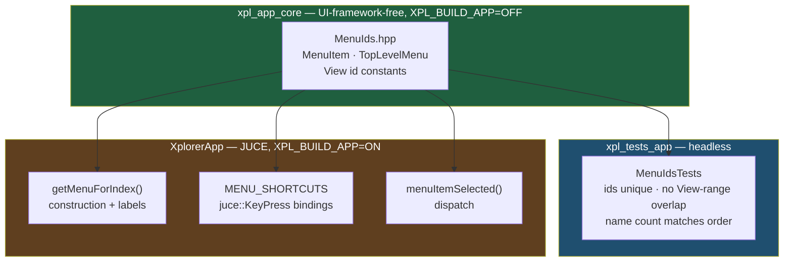

# ADR-QLT-001: Menu Identity as a Single, Headless-Testable Source

## Status

Accepted

## Context

`MainComponent.cpp` states the identity of the main menu bar three times over,
in raw literals:

- the keyboard-shortcut table `MENU_SHORTCUTS` (13 raw ids),
- the menu construction in `getMenuForIndex` (22 raw ids),
- the selection dispatch in `menuItemSelected` (22 raw `case N:` labels).

Nothing but a trailing comment (`// New`, `// Open`, …) relates the three. A
change applied to one site alone compiles cleanly and silently breaks either the
shortcut or the action. The top-level menus are worse coupled still:
`getMenuBarNames()` returns five names positionally and `getMenuForIndex()`
switches on bare indices `0..4`, so reordering the names rewires every menu with
no diagnostic.

Two further forces bear on where the fix belongs:

- **The idiom already exists in the codebase.** The same file names its
  View-menu ids (`VIEW_SCALE_FIRST_ID = 50`, `VIEW_FULL_SCREEN_ID = 60`), and
  `PageFamilyBlock.cpp` names its context-menu ids
  (`COPY_PAGE_MENU_ITEM_ID`). This is an unapplied convention, not a missing
  one.
- **Nothing in `MainComponent.cpp` is testable today.** It belongs to the
  `XplorerApp` GUI target, gated behind `XPL_BUILD_APP` which defaults to `OFF`
  and pulls the full JUCE stack. No test target references it. Constants left
  in that translation unit therefore gain naming but no verification — and the
  invariants that actually matter here (ids unique; no fixed id inside the
  computed View scale range) are exactly the kind a test catches and a reader
  does not.

The View scale range makes the second invariant live rather than theoretical:
its ids are computed as `VIEW_SCALE_FIRST_ID + index` over
`WINDOW_SCALE_PRESETS`, so adding a sixth preset widens an id range that today
stops one short of `VIEW_FULL_SCREEN_ID`.

## Decision

**DEC-QLT-001** — Menu identity moves to a new UI-framework-free header,
`app/core/include/xplorer/app/MenuIds.hpp`, in the existing `xpl_app_core`
library: the `MenuItem` id enumeration, the `TopLevelMenu` order enumeration,
the View id constants, and accessors returning those sets for verification.
`xpl_app_core` links no UI framework (ADR-JUC-006), so the header is compiled
and tested in the headless `xpl_tests_app` target, which builds with
`XPL_BUILD_APP=OFF`.

**DEC-QLT-002** — The enumerators carry the reference's own id *values*
unchanged. This is a declaration change, not a renumbering: every id keeps the
integer it has today, so the reference parity recorded in ADR-JUC-032 is
untouched and the change is provably behaviour-preserving.

**DEC-QLT-003** — The keyboard-shortcut table **stays** in `MainComponent.cpp`,
keyed by `MenuItem` rather than by raw ints. Its modifier and key-code fields
are `juce::` types and cannot cross into the UI-framework-free layer. Splitting
identity (portable, testable) from key binding (JUCE-bound) is what keeps
DEC-QLT-001 possible at all; the binding table gains type safety without
migrating.

**DEC-QLT-004** — `TopLevelMenu`'s enumerator values *are* the `MenuBarModel`
indices, and `getMenuBarNames()` is built by iterating the same declaration
`getMenuForIndex()` switches on. Order is then stated once, and a name list of
the wrong length is a test failure rather than a silent rewiring.

**DEC-QLT-005** — Menu item **labels** stay at their construction sites. The
menus carry separators, submenus and icons that a flat id→label table cannot
express without restructuring `getMenuForIndex()` — which would be a functional
rewrite, outside this change's remit. Labels are single-occurrence literals
today and so are not part of the duplication this ADR addresses.

## Consequences

**Easier.** A menu item's id exists in exactly one place; the three sites now
reference a named enumerator, so a rename propagates by compiler error rather
than by inspection. The uniqueness and range-overlap invariants become
executable assertions in a suite that runs in the default headless build, where
no menu-related test could previously exist. Adding a window-scale preset now
fails a test if it would collide, instead of misrouting a menu action at
runtime.

**Harder.** Menu identity is now split across two files: ids in
`app/core`, key bindings and labels in `MainComponent.cpp`. A reader chasing
"what does F5 do" traverses one extra hop. This is the accepted price of
DEC-QLT-003 — the alternative is no test coverage at all.

**Constrained.** `MenuIds.hpp` must stay free of UI-framework includes;
admitting one would drop it out of the headless target and void RQ-QLT-010.
Every call site passing an id to JUCE now casts the enumerator to `int` at the
boundary, which is the visible marker of that constraint.

## Alternatives Considered

**Named constants inside `MainComponent.cpp`'s anonymous namespace.** The
smallest possible change, and it satisfies the "no unnamed literal" rule
literally. Rejected: it leaves every invariant unverifiable, since the file is
in a target that is off by default and covered by no test. The duplication would
be named but still unchecked, and the View-range overlap — the one defect a
reader is least likely to spot — would stay undetectable.

**Moving the whole menu model, labels and shortcuts included, into
`app/core`.** Most thorough on paper. Rejected on two counts: the shortcut
table's `juce::ModifierKeys` and `juce::KeyPress` types cannot enter a
UI-framework-free library without inverting ADR-JUC-006, and a flat id→label
table cannot express the existing separators, submenus and per-item icons, so
adopting it would mean rewriting `getMenuForIndex()` — a functional change this
work explicitly excludes.

**`constexpr int` constants rather than an `enum class`.** Equivalent for
naming. Rejected: an enumeration gives the id set a type, which is what lets the
verification accessors enumerate it exhaustively; loose constants would need a
second, hand-maintained list of themselves — reintroducing at the test level the
very duplication being removed.

## Diagram

<!-- Implements RQ-QLT-001, RQ-QLT-002, RQ-QLT-003, RQ-QLT-010.
     Preserves RQ-GUI-008 and ADR-JUC-032 reference parity unchanged. -->
