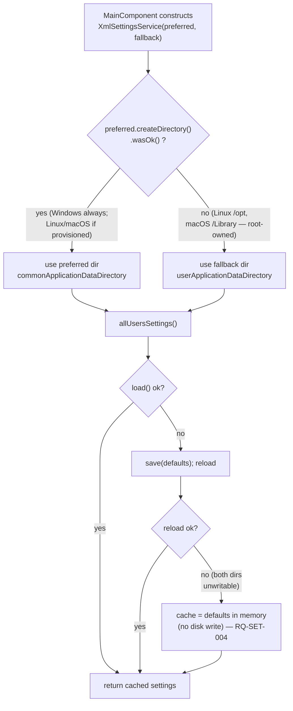

# ADR-SET-001: Settings-Directory Fallback and In-Memory Safety Net

## Status
Proposed (session SET, 2026-08-19).

<!-- Motivated by an owner bug report: on Linux, most persisted settings read back as
unset/zero after a restart (MIDI SysEx transmit delay 0, no knob LED colour, no knob-movement
radio checked, no randomizer checkbox checked). Manually setting values in the running app
"worked", but was lost on the next launch — i.e. no read, no write. Windows is unaffected;
macOS was flagged by the owner as suspected of the same defect but unverifiable locally.
[RQ-SET-001, RQ-SET-004] -->

## Context

`MainComponent.cpp:69-75` resolves the settings directory with:

```cpp
juce::File::getSpecialLocation(juce::File::commonApplicationDataDirectory)
    .getChildFile("Xplorer").getChildFile("Xplorer")
```

JUCE's own per-platform mapping of `commonApplicationDataDirectory`
(`juce_Files_windows.cpp:722`, `juce_Files_linux.cpp:137`, `juce_Files_mac.mm:210`):

| Platform | Resolves to | Writable by a standard user? |
|---|---|---|
| Windows | `%ProgramData%` (`CSIDL_COMMON_APPDATA`) | Yes — default NTFS ACLs let a standard user create new subfolders directly under `C:\ProgramData` |
| Linux | `/opt` | No — root-owned, mode 755 |
| macOS | `/Library` | No — root-owned, mode 755 |

This project ships no installer on Linux or macOS that could provision
`/opt/Xplorer/Xplorer` or `/Library/Xplorer/Xplorer` with user-writable permissions ahead of
first launch: the Linux deployment is an AppImage the user runs directly (DEC-BLD-021), and the
macOS one is a `.app` bundle copied into place, neither of which executes a privileged
provisioning step. So on both platforms, every attempt to create that directory was doomed
before the first line of the settings module ran.

**A second, independent defect compounded the symptom.** `XmlSettingsService::Impl::save()`
(`XmlSettingsService.cpp:277-281`) discards the `juce::Result` of `createDirectory()` and the
`bool` of `writeTo()` — so the failure above was silent, not reported. Worse,
`XmlSettingsService::allUsersSettings()` (`XmlSettingsService.cpp:292-306`) reacts to a missing
file by saving the in-code defaults and reloading, but if that save *also* fails (as it always
did here), the reload again returns `std::nullopt`, and the function falls through to
`return *_impl->cache;` — dereferencing a disengaged `std::optional`. That is undefined
behaviour, not the "fall back to documented defaults and continue" that RQ-SET-004 requires. In
this build it manifested as a near-zeroed `AllUsersSettings` rather than a crash — exactly the
symptom reported: a transmit delay of `0` instead of the documented default `30`, an unset knob
colour instead of `0xFF66B5E3`, boolean/enum fields reading as `0`/false so no radio button or
checkbox in the Settings dialog matched a valid option. Manually setting values "worked" only
because `saveSettings()` unconditionally updates the in-memory cache
(`XmlSettingsService.cpp:308-312`) regardless of whether the disk write behind it succeeded —
the in-session illusion of persistence the owner described, gone on the next launch because
nothing was ever actually written.

Existing tests never exercised this path: `SettingsServiceTests.cpp` always constructs the
service against a fresh, writable temp directory, so the write never fails and the UB branch is
never reached.

## Decision

### DEC-SET-001 — `XmlSettingsService` takes a preferred and a fallback directory; the app supplies the per-user one as fallback; the loader never dereferences an empty cache

**Directory resolution** (`XmlSettingsService.cpp`, new `resolveSettingsDirectory()`): the
constructor gains an optional second parameter, `fallbackDirectory` (default `""`, preserving
the single-directory behaviour every existing caller and test relies on). When non-empty, the
constructor attempts `preferred.createDirectory()`; if that `Result` is not OK, it uses the
fallback directory instead — checked once, at construction, using the exact `Result` the save
path already computes but previously discarded, so the check and the later write agree by
construction rather than by a separate probe that could disagree with it.

`MainComponent.cpp` passes `commonApplicationDataDirectory` (unchanged; still tried first, so an
admin-provisioned or future-installed shared location is still honoured on any platform) as
preferred, and `userApplicationDataDirectory` — JUCE maps this to `~/.config` (`XDG_CONFIG_HOME`)
on Linux and `~/Library` on macOS, both owned and writable by the running user with no privilege
escalation — as fallback. Windows passes the same two values but never needs the fallback, since
`%ProgramData%` already succeeds there; behaviour is unchanged on that platform.

**In-memory safety net** (`allUsersSettings()`): if the save-then-reload sequence still yields no
value — both directories unwritable, e.g. a fully read-only filesystem — the cache is set to
`defaultAllUsersSettings()` directly in memory instead of falling through to dereference the
empty `std::optional`. This is RQ-SET-004's "fall back to documented defaults and continue",
made to actually hold in the one case it previously didn't; it costs one `if` and no behaviour
change on the path that already worked.

*Rejected: resolve the directory with `#if JUCE_WINDOWS` / `#if JUCE_LINUX` / `#if JUCE_MAC`.*
Encodes the same three-way table as data hidden in conditional compilation, is not exercised by
a test running on any single platform (each build only ever compiles its own branch), and would
need a fourth branch the day a Linux or macOS installer ever does provision a writable shared
directory. The runtime `Result`-based check degrades gracefully instead of requiring a rebuild
when that changes, and is exercised identically on every platform's own CI.

*Rejected: silently retry into a hard-coded temp directory.* Works, but the OS temp directory is
routinely cleared (including on Linux, by `systemd-tmpfiles` or a reboot with `tmpfs`), which
would turn "settings survive a restart" into "settings survive most restarts" — trading one
silent-loss bug for a quieter one instead of fixing it.

*Rejected: throw / hard-fail when the preferred directory is unwritable.* Turns a cosmetic
defaults problem into an application that refuses to start on exactly the platforms this ADR
is trying to make usable; RQ-SET-004 already commits to continuing on a defaults fallback, and a
throw would contradict it.

## Consequences

**Easier.** Settings actually persist across restarts on Linux, and — on the same mechanism,
unverified locally but structurally identical per the JUCE table above — on macOS. A future
unwritable-directory failure of any kind, on any platform, degrades to per-user storage or, in
the worst case, in-memory defaults, instead of silently losing data or invoking undefined
behaviour.

**Harder.** Two on-disk locations now exist across a machine's lifetime (a stale, empty, or
partially-written `/opt/Xplorer/Xplorer` from a prior run cannot itself cause harm — the loader
only trusts a file it can parse — but a support conversation may need to know both paths;
`settingsFilePath()` already reports the one actually in use).

**Constrained.** "Per-machine" settings sharing across OS user accounts on the same box now only
happens on Linux/macOS when the shared directory happens to be writable (e.g. the app is run as
root, or a future installer chmods it) — otherwise each OS user account gets its own settings
file. Given neither platform has a privileged install step today, this is the realistic behaviour
already in effect; the fallback makes it also the *working* one instead of a silent no-op.

**Unchanged.** The XML schema, the `.NET` import path (RQ-SET-006), Windows behaviour, and every
existing single-directory call site (tests, `InMemorySettingsService`).

## Alternatives Considered

- **Per-platform `#ifdef` directory selection.** Rejected under DEC-SET-001 — see there.
- **Hard-coded OS temp directory as the fallback.** Rejected under DEC-SET-001 — not durable
  across a real restart on Linux.
- **Fail fast on an unwritable preferred directory.** Rejected under DEC-SET-001 — contradicts
  RQ-SET-004.
- **Probe writability with a throwaway file instead of reusing `createDirectory()`'s `Result`.**
  Works, but is a second check that could disagree with the one `save()` performs a moment later
  (e.g. a directory that can be created but whose immediate child cannot, under an unusual ACL);
  reusing the exact call `save()` already makes keeps the check and the effect as one operation.

## Diagram


